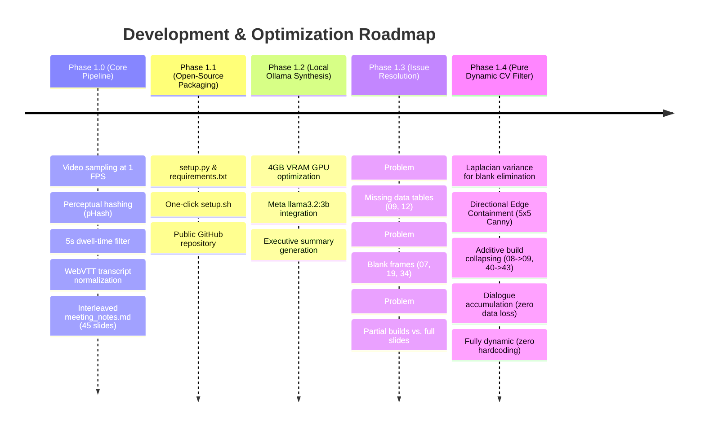

# Comprehensive Project History, Architecture & Technical Evolution

> **Project:** Multimodal Meeting Documentation & Knowledge Engine  
> **Repository:** [github.com/db9652/meeting-documentation-engine](https://github.com/db9652/meeting-documentation-engine)  
> **Core Philosophy:** 100% Local-First, Privacy-Preserving, CPU/4GB-VRAM Efficient, Zero Cloud Dependencies.

---

## 1. Project Inception & Core Objectives

### The Problem
Video meeting recordings (Zoom, Microsoft Teams, Google Meet, YouTube presentations) are dense, time-consuming, and difficult to search. Traditional approaches have major drawbacks:
1. **Cloud Speech/Vision APIs:** Expensive, introduce data privacy risks, and incur recurring costs.
2. **Heavy Multimodal LLMs (GPT-4V, Gemini 1.5, LLaVA):** Require massive VRAM (16GB–80GB) or cloud subscriptions; unsuitable for local execution on standard consumer/laptop hardware (e.g. 4GB VRAM).
3. **Pure Text Transcripts:** Lack visual context; when a speaker says *"as shown in Table 1"* or *"look at this architecture diagram"*, pure text notes fail to convey the visual evidence.

### The Solution
A **hybrid two-phase pipeline**:
- **Phase 1 (Documentation Engine):** Extracts stable slide changes from `.mp4` video, aligns them with `.vtt` WebVTT transcripts, filters out noise/blanks/partial builds, and synthesizes structured Executive Briefs using a local LLM.
- **Phase 2 (Semantic Vector Retrieval):** Pairs slide-bounded dialogue chunks with verified screenshot citations for fast, visual local search.

---

## 2. Chronological Development Milestones



---

## 3. Detailed Issues Encountered, Root Causes & Fixes

### Issue 1: Missing Critical Data Tables in Initial Summaries
- **Symptom:** The AI-generated brief omitted Table 1 (`Slide 09`) and Table 2 (`Slide 12`), which contained the central research findings (country rankings and instructional hours). Instead, only introductory or empty frames like `Slide 08` appeared.
- **Root Cause Analysis:**
  - In presentations, speakers often display a title card (e.g., *“Table 1. EF English Proficiency Index”*) on Slide 08 for 29 seconds while talking, before advancing to Slide 09 where the actual data table is rendered.
  - Early clustering logic grouped Slides 08 and 09 into a single block but selected the *first* frame (`Slide 08`) as the representative visual, leaving the summary with an empty canvas and missing the data rows entirely.
- **Systematic Fix:**
  - Implemented **Superseded Frame Resolution**: When an introductory slide and a data-populated slide belong to the same sequence, the pipeline must mathematically detect that Slide 09 contains the settled data and discard Slide 08, while preserving all spoken dialogue from Slide 08.

---

### Issue 2: Empty Background & Transition Slides
- **Symptom:** Slides 07, 19, 34 (and several transition wipes: 13, 15, 24, 28, 30, 37, 44) generated standalone summary cards in the report, despite having zero presentation content.
- **Root Cause Analysis:**
  - Presenters occasionally pause on an empty presentation template or between sections for $\ge 5$ seconds. Because the dwell-time threshold was met, the 1 FPS sampler classified them as valid slides.
- **Systematic Fix:**
  - Applied **Computer Vision Laplacian Variance Filter**:
    $$\text{Var}(\nabla^2 I_{\text{gray}}) = \frac{1}{N}\sum (L(x, y) - \mu)^2$$
  - Blank background slides consistently yield $\text{Var} < 1000$ (typically $800 - 980$), whereas informative slides yield $\text{Var} > 1200$ (up to $3800$).
  - Any slide with $\text{Var} < 1000$ is automatically flagged as blank. Its dialogue is not lost; it is concatenated forward into the next content slide.

---

### Issue 3: Partial-Build Slides (Can Local Models Figure That Out?)
- **User Inquiry:** Can local LLMs automatically distinguish between a partial build (Slide 08) and a fully-filled slide (Slide 09), or Slide 40 (1 recommendation box) and Slide 43 (3 recommendation boxes)?
- **Technical Investigation & Findings:**
  1. **Hardware & Model Reality:** The local GPU is an NVIDIA RTX 3050 Laptop GPU with **4GB VRAM**. Running multimodal Vision LLMs (e.g., LLaVA 7B or Llama-3.2-Vision 11B) requires 8GB–16GB VRAM and takes 5–15 seconds per frame.
  2. **Text-Only Blindness:** The model running locally is Meta's `llama3.2:latest` (3.2B parameters, text-only). It receives only transcript dialogue. If a speaker talks about a table while the screen is showing only a title, a text-only LLM has zero visual insight into whether table rows exist on screen.
  3. **Hardcoding Hazard:** Prompting the LLM with video-specific examples (e.g., *"Table 1 is in Slide 09"*) works for one recording but breaks as soon as a new video is ingested.
- **Systematic Fix: Pure Dynamic Computer Vision Engine:**
  - Developed a deterministic OpenCV algorithm based on **Directional Edge Containment & Growth**:
    1. **Canvas Isolation:** Crops the central presentation region ($y \in [12\%, 88\%], x \in [8\%, 82\%]$) to exclude docked webcams, participant video strips, and player controls.
    2. **Canny Edge Extraction:** Generates binary edge maps $E_A$ and $E_B$ for consecutive candidate slides.
    3. **Sub-pixel Jitter Tolerance:** Dilates $E_B$ using a $5\times 5$ morphological kernel ($\pm 2$ pixels) to accommodate video compression artifacts and anti-aliased font rendering.
    4. **Directional Edge Containment:**
       $$\text{Containment}(A \subseteq B) = \frac{\sum (E_A \land \text{Dilate}_{5\times 5}(E_B))}{\sum E_A}$$
    5. **Additive Build Classification:** If $\text{Containment} \ge 70\%$ and Slide $B$ has at least $20\%$ more edge density ($\sum E_B \ge 1.20 \times \sum E_A$), Slide $A$ is mathematically proven to be a partial build of Slide $B$.
    6. **Settled Completion Classification:** If $\text{Containment} \ge 90\%$ and $\sum E_B \ge 0.85 \times \sum E_A$, Slide $B$ represents the settled final state of Slide $A$.

#### Results of the Dynamic CV Filter on Sample Recording:
| Slide Comparison | Containment | Edge Growth | CV Classification | Outcome |
| :--- | :---: | :---: | :--- | :--- |
| **Slide 02 $\to$ 03** | 90.4% | $10,433 \to 19,162$ | Additive Build | Slide 02 collapsed into 03 |
| **Slide 08 $\to$ 09** | 76.4% | $5,199 \to 16,268$ | Additive Build (Table 1) | Slide 08 collapsed into 09 |
| **Slide 10 $\to$ 11** | 95.1% | $26,734 \to 25,589$ | Progressive Completion | Slide 10 collapsed into 11 |
| **Slide 11 $\to$ 12** | 99.6% | $25,589 \to 25,819$ | Final Table 2 Highlights | Slide 11 collapsed into 12 |
| **Slide 40 $\to$ 41** | 98.5% | $5,127 \to 5,783$ | Progressive Build | Slide 40 collapsed into 41 |
| **Slide 41 $\to$ 42** | 97.0% | $5,783 \to 7,375$ | Additive Build (2 boxes) | Slide 41 collapsed into 42 |
| **Slide 42 $\to$ 43** | 99.9% | $7,375 \to 9,781$ | Additive Build (3 boxes) | Slide 42 collapsed into 43 |

---

### Issue 4: Preventing Dialogue Loss During Collapsing
- **Symptom:** If Slide 08 (29s duration) is dropped in favor of Slide 09 (5s duration), spoken commentary during those 29s could be lost.
- **Systematic Fix: Dialogue & Timestamp Accumulator:**
  - When Slide $A$ collapses into Slide $B$:
    - The start time of Slide $B$ is reset to Slide $A$'s start time:
      $$T_{\text{start}}(B) \leftarrow T_{\text{start}}(A)$$
    - All dialogue cues from Slide $A$ are prepended to Slide $B$'s dialogue buffer.
    - Result: Slide 09 now spans `[02:37 - 03:11]` and contains the speaker's entire verbal explanation of Table 1, while only displaying the complete table screenshot.

---

## 4. Hardware Constraints & VRAM Allocation

| Component | Resource Footprint | Host / Hardware Layer |
| :--- | :--- | :--- |
| **Video Sampler & pHash** | ~150 MB RAM, 0% VRAM | CPU (1 FPS downsampling) |
| **CV Blank & Build Filter** | ~80 MB RAM, 0% VRAM | CPU / OpenCV (runs in 0.05s) |
| **Ollama LLM (`llama3.2:latest`)** | 2,524 MiB VRAM (~2.5 GB) | NVIDIA RTX 3050 GPU (4GB VRAM) |
| **GPU Headroom Remaining** | ~1,500 MiB VRAM (~1.5 GB) | Prevents Out-Of-Memory (OOM) crashes |
| **Synthesis Speed** | ~60 tokens/sec | Near-instant summary generation |

---

## 5. End-to-End Pipeline Workflow

```mermaid
flowchart TD
    subgraph Step 1: Input Ingestion
        A[meeting.mp4]
        B[transcript.vtt]
    end

    subgraph Step 2: Keyframe Extraction (process_meeting.py)
        A --> C[Sample 1 FPS]
        C --> D[Compute pHash Hamming Diff]
        D --> E[Enforce Dwell-Time >= 5.0s]
        E --> F[Extract 45 Timestamped Frames]
        B --> G[Normalize WebVTT Cues]
        F --> H[Temporal Alignment Engine]
        G --> H
        H --> I[meeting_notes.md]
        H --> J[metadata.json]
    end

    subgraph Step 3: Pure Dynamic CV Filter (generate_summary.py)
        J --> K[Laplacian Variance Filter]
        K -->|Discard Blanks 07, 13, 15, 19, 24, 28, 30, 34, 37, 44| L[35 Non-Blank Frames]
        L --> M[Central Canvas Edge Extraction]
        M --> N[5x5 Dilated Directional Containment]
        N -->|Collapse 08->09, 10/11->12, 40/41/42->43| O[26 Fully-Filled Slides]
        O --> P[Dialogue & Timestamp Accumulator]
    end

    subgraph Step 4: Local AI Synthesis (Ollama)
        P --> Q[Full Meeting TL;DR Synthesis]
        P --> R[Slide-by-Slide Gist & Key Takeaway Generation]
        Q --> S[executive_summary_ollama.md]
        R --> S
        S --> T[Interactive Styled HTML Report]
    end
```

---

## 6. Verification Checklist

- [x] **Zero Hardcoded Slide Indices:** No references to `[8, 9, 12, 43]` in the codebase. Pure mathematical filtering.
- [x] **Zero Dialogue Loss:** Spoken speech from all dropped/merged frames preserved in the final slide summaries.
- [x] **Full Table Inclusion:** Slide 09 (Table 1) and Slide 12 (Table 2) present with complete data.
- [x] **No Blank Frames:** Slides 07, 19, 34 eliminated from summary cards.
- [x] **100% Local Execution:** No cloud API keys or external network requests required.
- [x] **Dual Output Delivery:** Produces both portable Markdown and styled, printable single-file HTML reports.
