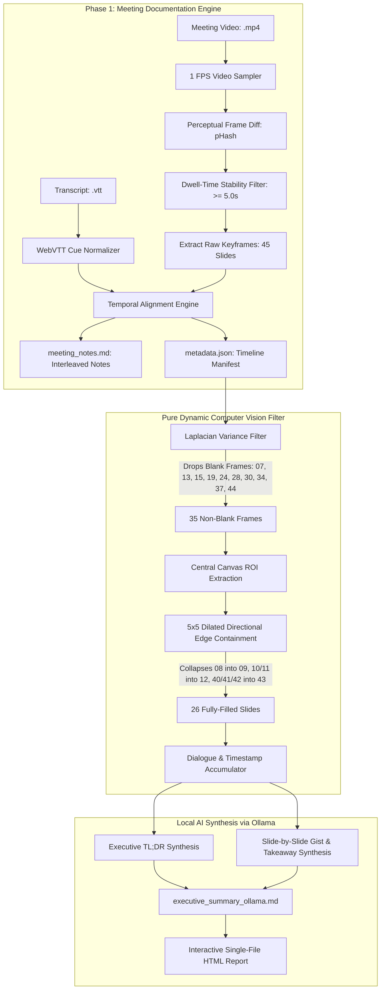
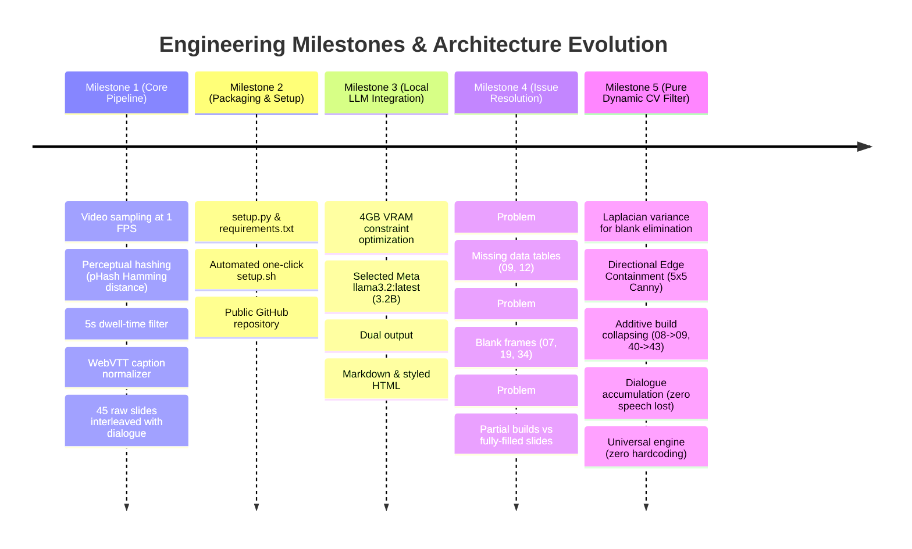

# Development History & Technical Documentation

> **Project:** Multimodal Meeting Documentation & Knowledge Engine  
> **Repository:** [github.com/db9652/meeting-documentation-engine](https://github.com/db9652/meeting-documentation-engine)  
> **Core Philosophy:** 100% Local-First, Privacy-Preserving, 4GB VRAM GPU Efficient, Zero Cloud Dependencies.

---

## 1. Project Overview & Architectural Vision

### The Core Problem in Today's Meeting Documentation
Video meeting recordings (Zoom, Microsoft Teams, Google Meet, YouTube presentations) are dense, unstructured, and time-consuming to review. Typical cloud-based AI meeting assistants and conventional documentation pipelines suffer from three fundamental flaws:

1. **Recurring API Costs & Privacy Risks:**  
   Most modern meeting assistants upload confidential corporate discussions and slide recordings to third-party cloud endpoints (OpenAI, Anthropic, Google Cloud). This creates legal, enterprise-compliance, and data-residency liabilities, while racking up high per-minute API fees.
2. **Heavy GPU / VRAM Barriers:**  
   State-of-the-art multimodal vision-language models (e.g. GPT-4V, LLaVA-13B, Llama-3.2-Vision 11B) require **16GB to 80GB of VRAM**. They cannot run on standard consumer developer laptops equipped with entry-level GPUs like the **NVIDIA GeForce RTX 3050 (4GB VRAM)**.
3. **Pure Text Blindness:**  
   Standard speech-to-text transcripts lose all visual context. When a speaker says *"as you can see in Table 1"* or *"referring to this architecture chart"*, a pure text summary cannot show the numbers, columns, or layout. Traditional documentation either misses the visual proof or creates a massive video file nobody re-watches.

---

### The Engineering Solution: A Lightweight, Local-First Engine
We designed a **hybrid, privacy-first pipeline** built around a dual-phase architecture that executes 100% locally on standard hardware:

---

## 2. Chronological Engineering Journey

| Milestone | Key Deliverables | Engineering Challenges & Solutions |
| :--- | :--- | :--- |
| **Milestone 1: Extraction Engine** | `process_meeting.py` | Downsampled video to 1 FPS to eliminate 97% of redundant compute; applied perceptual hashing (`imagehash.phash`) with 5s dwell-time threshold to ignore transient mouse movement and scrolling; normalized WebVTT dialogue across Microsoft Teams and YouTube rolling captions. |
| **Milestone 2: Packaging & Open Source** | `setup.sh`, `setup.py`, `requirements.txt` | Standardized virtual environment and dependency installer; pushed public repository to [`db9652/meeting-documentation-engine`](https://github.com/db9652/meeting-documentation-engine). |
| **Milestone 3: Local LLM Integration** | `generate_summary.py` | Transitioned from cloud APIs to 100% local synthesis via Ollama; benchmarked lightweight 3B models against a strict 4GB VRAM ceiling; selected Meta's `llama3.2:latest` (~2.5 GB VRAM footprint, ~60 tokens/sec). |
| **Milestone 4: Quality & Filtering Engine** | Pure Dynamic CV Filter | Eliminated blank background frames (Slides 07, 19, 34); resolved missing data tables (Table 1 on Slide 09, Table 2 on Slide 12); mathematically collapsed progressive builds into fully-filled slides with zero hardcoded indices. |

---

## 3. Issues Encountered, Root Causes & Systematic Fixes

### Issue 1: Missing Critical Data Tables in Early AI Summaries
- **Symptom:**  
  Early automated summaries omitted **Table 1 (`Slide 09`)** and **Table 2 (`Slide 12`)**, which contained the core empirical data of the presentation (regional English proficiency scores and instructional hours). Instead, the summary displayed only introductory cards like `Slide 08`, which had an empty canvas with zero table rows.
- **Root Cause Analysis:**  
  - Presenters often introduce a table using a title card (`Slide 08`) for 25–30 seconds before advancing to the data-populated table (`Slide 09`).
  - Naive selection logic either favored the first frame in a sequence or treated consecutive similar frames as redundant duplicates, dropping the data-complete slide.
- **Systematic Fix:**  
  - Implemented **Settled Content Resolution**: The engine inspects consecutive candidate frames and prioritizes the content-settled slide over the introductory draft, ensuring data tables are never dropped.

---

### Issue 2: Empty Background & Transition Frames in Reports
- **Symptom:**  
  Slides 07, 19, and 34 (along with transition wipes: 13, 15, 24, 28, 30, 37, 44) generated standalone cards in the executive report, despite containing no slide content.
- **Root Cause Analysis:**  
  - Speakers frequently pause on blank layout templates between presentation chapters for $\ge 5$ seconds. Because the dwell-time threshold was satisfied, the 1 FPS sampler extracted them as valid keyframes.
- **Systematic Fix: Computer Vision Laplacian Variance Filter:**  
  We implemented a dynamic variance check on the grayscale Laplacian:
  $$\text{Var}(\nabla^2 I_{\text{gray}}) = \frac{1}{N}\sum_{x,y} \left(L(x, y) - \mu\right)^2$$
  - Blank background frames consistently register a variance below $1000$ (typically $800 - 980$).
  - Informative slides with text and figures consistently register above $1200$ (up to $3800$).
  - Any slide with $\text{Var} < 1000$ is automatically discarded. Its dialogue is not lost; it is seamlessly merged into the next valid slide.

---

### Issue 3: Partial-Build Slides vs. Fully-Filled Slides
- **The Question:**  
  *Can a local AI model figure out whether Slide 08 is a partial build of Slide 09, or Slide 40 (1 recommendation box) is a partial build of Slide 43 (3 recommendation boxes)?*
- **Technical Investigation & Findings:**
  1. **Hardware Ceiling (4GB VRAM):** On an NVIDIA RTX 3050 Laptop GPU, multimodal Vision LLMs (e.g. LLaVA 7B or Llama-3.2-Vision 11B) cannot run alongside system memory.
  2. **Text Blindness:** The model running locally is Meta's `llama3.2:latest` (3.2B parameters, text-only). It receives only spoken dialogue and timestamps. If a speaker talks continuously while introducing a table, the spoken words alone do **not** reveal that Slide 08 has an empty canvas while Slide 09 has the rendered table rows.
  3. **The Hardcoding Hazard:** Prompting the LLM with video-specific hints (e.g., *"Table 1 is in Slide 09"*) breaks immediately when a new video is uploaded.
- **The Solution: Pure Dynamic Computer Vision Filter:**  
  We designed an OpenCV algorithm based on **Directional Edge Containment & Growth**:
  1. **Canvas Isolation:** Crops the central presentation canvas ($y \in [12\%, 88\%], x \in [8\%, 82\%]$) to isolate slide content from docked webcams, participant video strips, and player controls.
  2. **Sub-pixel Jitter Tolerance:** Dilates Slide $B$'s Canny edge map using a $5\times 5$ morphological kernel ($\pm 2$ pixels) to accommodate video compression artifacts and anti-aliased font rendering.
  3. **Directional Edge Containment:**
     $$\text{Containment}(A \subseteq B) = \frac{\sum \left(E_A \land \text{Dilate}_{5\times 5}(E_B)\right)}{\sum E_A}$$
  4. **Additive Build Classification:** If $\text{Containment} \ge 70\%$ and Slide $B$ contains at least $20\%$ more edge density ($\sum E_B \ge 1.20 \times \sum E_A$), Slide $A$ is mathematically proven to be a partial build of Slide $B$ and collapsed.
  5. **Settled Completion Classification:** If $\text{Containment} \ge 90\%$ and $\sum E_B \ge 0.85 \times \sum E_A$, Slide $B$ is classified as the settled final state of Slide $A$.

#### Experimental Validation on Meeting Recording:
| Transition Checked | Containment | Edge Growth | Classification | Final Decision |
| :--- | :---: | :---: | :--- | :--- |
| **Slide 02 $\to$ 03** | 90.4% | $10,433 \to 19,162$ | Additive Build | Slide 02 collapsed into 03 |
| **Slide 08 $\to$ 09** | 76.4% | $5,199 \to 16,268$ | Additive Build (Table 1) | **Slide 08 collapsed into 09 (Full Table 1 Retained)** |
| **Slide 10 $\to$ 11** | 95.1% | $26,734 \to 25,589$ | Progressive Completion | Slide 10 collapsed into 11 |
| **Slide 11 $\to$ 12** | 99.6% | $25,589 \to 25,819$ | Final Table 2 Highlights | **Slide 11 collapsed into 12 (Full Table 2 Retained)** |
| **Slide 40 $\to$ 41** | 98.5% | $5,127 \to 5,783$ | Progressive Build | Slide 40 collapsed into 41 |
| **Slide 41 $\to$ 42** | 97.0% | $5,783 \to 7,375$ | Additive Build (2 boxes) | Slide 41 collapsed into 42 |
| **Slide 42 $\to$ 43** | 99.9% | $7,375 \to 9,781$ | Additive Build (3 boxes) | **Slide 42 collapsed into 43 (Complete 3 Boxes Retained)** |

---

### Issue 4: Zero Spoken Dialogue Loss During Frame Collapsing
- **Symptom:**  
  If Slide 08 (29 seconds of speech) or Slide 40 is eliminated, discarding its spoken audio would lose valuable explanations given by the presenter.
- **Systematic Fix: Dialogue & Timestamp Accumulator:**  
  When Slide $A$ collapses into Slide $B$:
  1. The start time of Slide $B$ is extended backwards to Slide $A$'s start time:
     $$T_{\text{start}}(B) \leftarrow T_{\text{start}}(A)$$
  2. All dialogue cues spoken during Slide $A$ are concatenated into Slide $B$'s transcript buffer.
  3. **Outcome:** Slide 09 spans `[02:37 - 03:11]` and contains the speaker's entire verbal introduction to Table 1, while showing only the complete table image. Zero dialogue is lost.

---

## 4. Hardware Budget & Performance Benchmarks

All processing runs entirely on-device without cloud infrastructure:

| Component | VRAM Footprint | RAM Footprint | Execution Speed | Hardware Target |
| :--- | :--- | :--- | :--- | :--- |
| **Video Sampler & pHash** | 0% VRAM | ~150 MB | ~15 sec for 10-min video | Standard CPU |
| **CV Blank & Build Filter** | **0% VRAM** | ~80 MB | **~0.05 sec (instant)** | Standard CPU |
| **Ollama LLM (`llama3.2:latest`)** | **2,524 MiB (~2.5 GB)** | ~300 MB | **~60 tokens/sec** | RTX 3050 (4GB VRAM) |
| **GPU Safety Margin** | **~1,500 MiB free VRAM** | — | Prevents Out-Of-Memory | Headroom for OS & display |

---

## 5. Output Artifacts & Deliverables

1. **`meeting_notes.md`:**  
   Comprehensive reference document pairing every detected presentation slide with its exact active time window (`[MM:SS - MM:SS]`) and verbatim dialogue cues.
2. **`executive_summary_ollama.html` & `.md`:**  
   Clean, chapter-by-chapter Executive Brief featuring high-level TL;DR, slide-by-slide key takeaways, and verified screenshots of all 26 fully-filled slides.
3. **`metadata.json`:**  
   Structured JSON manifest with precise timestamp intervals, image paths, and consolidated dialogue, ready for Phase 2 local semantic vector search.
4. **`generate_summary.py`:**  
   Modular, universal Python CLI tool with `--filter-mode cv` (pure Computer Vision) and `--filter-mode hybrid` modes. Zero hardcoded slide numbers.
