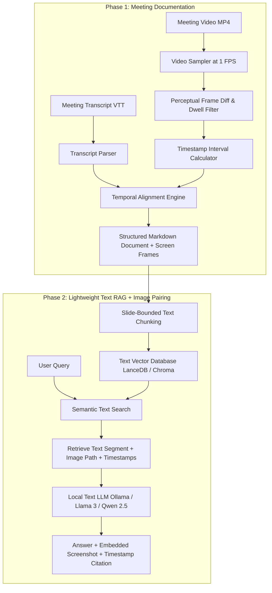

# Project Blueprint & Implementation Plan: Lightweight Multimodal Meeting Knowledge Base

---

## 1. Executive Summary

This project creates a lightweight, privacy-first meeting knowledge base from recorded meetings (e.g., Microsoft Teams, Zoom) and their timestamped transcripts.

* **Phase 1 (Documentation Engine):** Extracts visual screen/slide changes from video files, calculates active time intervals, and compiles a chronologically interleaved Markdown document pairing spoken dialogue with the corresponding screenshot.
* **Phase 2 (Lightweight AI Chatbot):** Uses standard, fast text-based semantic search to query meeting transcripts. When relevant discussions are found, the chatbot synthesizes an answer from what was spoken and directly presents the **associated screenshot and timestamps** so the user can visually inspect what was on screen.

> **Key Architectural Decision: Zero Heavy Image Processing**  
> We deliberately exclude heavy vision models, visual embeddings, and OCR pipelines. The system indexes purely the structured text dialogue, while using the visual frames as verifiable citation artifacts presented directly to the user. This keeps the system fast, resource-efficient, and runnable on standard CPUs.

---

## 2. Streamlined System Architecture



---

# Phase 1: Meeting Documentation Engine (Work Plan)

### Objective
Ingest meeting video (`.mp4`) and timestamped transcript (`.vtt`/`.docx`), detect slide changes, calculate active time ranges, and compile a clean Markdown document where dialogue is grouped under its corresponding screenshot.

---

### Stage 1.1: Input Ingestion & Transcript Normalization
* **Video Validation:** Read video duration, resolution, and frame rate.
* **Transcript Parsing:** Parse WebVTT (`.vtt`) files into structured dialogue cues:
  * `speaker_name`: Name of speaker.
  * `start_seconds` / `end_seconds`: Exact cue timing.
  * `text`: Spoken dialogue.

---

### Stage 1.2: Lightweight Keyframe Extraction
* **1 FPS Downsampling:** Sample video once per second to reduce processing compute by 97%.
* **Perceptual Difference Comparison:** Compare frames using perceptual hashing (`pHash`) or structural difference with a ~10–15% sensitivity threshold.
* **Noise & Stability Filtering:**
  * **Webcam Dock Masking:** Ignore docked webcam regions to avoid false positives from talking heads.
  * **Dwell-Time Filter:** Enforce a minimum stability threshold (3–5 seconds) to avoid capturing transient animations or mouse movement.

---

### Stage 1.3: Interval Calculation & File Naming
* **Active Range Calculation:** Frame $i$ is active from its capture time $T_i$ until the next frame $T_{i+1}$:
  $$\text{Active Window} = [T_i, T_{i+1})$$
* **Asset Naming Standard:**
  * Pattern: `{Meeting_Name}_frame_{Index}_{Start_Time}_to_{End_Time}.png`
  * Example: `Sprint_Sync_frame_002_03m15s_to_07m45s.png`

---

### Stage 1.4: Temporal Alignment & Markdown Compilation
* **Alignment Logic:** Assign dialogue cues to frame sections where:
  $$T_{\text{start, dialogue}} \in [T_i, T_{i+1})$$
* **Markdown Document Structure:**
  ```markdown
  # Weekly Team Sync - 2026-08-30

  ## Discussion 2: Architecture Review [03:15 - 07:45]
  

  - **[03:20] Alice**: As you can see from the diagram, we decoupled the auth service.
  - **[04:05] Bob**: Does the new cache layer sit in front of Redis?
  ```

---

# Phase 2: Lightweight Knowledge Base & Chatbot (Work Plan)

### Objective
Provide a responsive local Q&A chatbot that answers questions based on meeting transcripts and displays the relevant screenshots alongside the text for visual verification.

---

### Stage 2.1: Slide-Bounded Text Indexing
* **Chunking Strategy:** Chunk by **visual slide section** (Section 1, Section 2, etc.). Each chunk contains:
  * Section title and time range (`[03:15 - 07:45]`).
  * Relative image path (`frames/frame_002_...png`).
  * Combined dialogue spoken during that interval.
* **Text Embeddings:** Generate embeddings using a lightweight local embedding model (e.g., `all-MiniLM-L6-v2`, `BGE-Small`, or `Nomic-Embed-Text`).
* **Vector Storage:** Store chunks in a fast, embedded local database (e.g., **ChromaDB** or **LanceDB**).

---

### Stage 2.2: Retrieval & Image Pairing
* **Semantic Search:** When a user asks a question (e.g., *"What did Alice say about the auth service?"*), search the vector database for the closest dialogue chunks.
* **Metadata & Image Association:** Retrieve the top matching text chunk along with its pre-linked image file path and timestamp interval.

---

### Stage 2.3: Local LLM Synthesis & Response Formatting
* **Local Text LLM:** Run standard, lightweight local text models via **Ollama** or **llama.cpp** (e.g., `Llama-3.2-3B`, `Qwen-2.5-7B`, or `Mistral-7B`).
* **Prompt Assembly:**
  * System prompt instructing the model to synthesize answers based solely on spoken dialogue and cite the meeting section/timestamps.
  * Retrieved dialogue context.
  * User question.
* **Chatbot Output Structure:**
  The assistant formats its response to include:
  1. **Direct Answer:** Synthesizing what the speaker discussed.
  2. **Timestamp Reference:** e.g., `[03:15 - 07:45]`.
  3. **Visual Citation:** Embedded screenshot displayed inline so the user can inspect the visual details.

#### Example Chatbot Interaction:
> **User:** *"What did we decide about the auth service during the sync?"*  
>  
> **Assistant:**  
> *"Alice explained that the auth service was decoupled from the main gateway to improve scalability, and Bob asked about placing the cache in front of Redis [03:15 - 07:45].*  
>  
> **Visual Reference:**  
> *

---

## 3. Benefits of this Lightweight Architecture

| Feature | Heavy Multimodal Approach | Our Lightweight Approach |
| :--- | :--- | :--- |
| **Image Processing Overhead** | High (OCR + Vision Embeddings) | **Zero (Images are passed as static references)** |
| **Hardware Requirement** | High VRAM GPU ($\ge 16\text{ GB}$) | **Low (Runs easily on standard CPU / 8GB RAM)** |
| **Indexing Speed** | Slow (Minutes per meeting) | **Instant (< 2 seconds per meeting)** |
| **Visual Accuracy** | Relies on AI visual interpretation | **100% human-verifiable via exact screenshot** |
| **Maintenance & Setup** | Complex dependencies | **Simple Python script + local text LLM** |

---

## 4. Implementation Roadmap

| Milestone | Deliverable | Key Success Criteria |
| :--- | :--- | :--- |
| **Milestone 1** | Ingestion & Frame Extraction | Extract stable keyframes with interval naming (`start_to_end`). |
| **Milestone 2** | Markdown Compiler | Output clean `.md` documents with interleaved dialogue and images. |
| **Milestone 3** | Lightweight Vector Indexing | Index text chunks into ChromaDB/LanceDB with metadata image paths. |
| **Milestone 4** | Local Q&A Chatbot | Query transcripts and output answers with embedded screenshots. |
