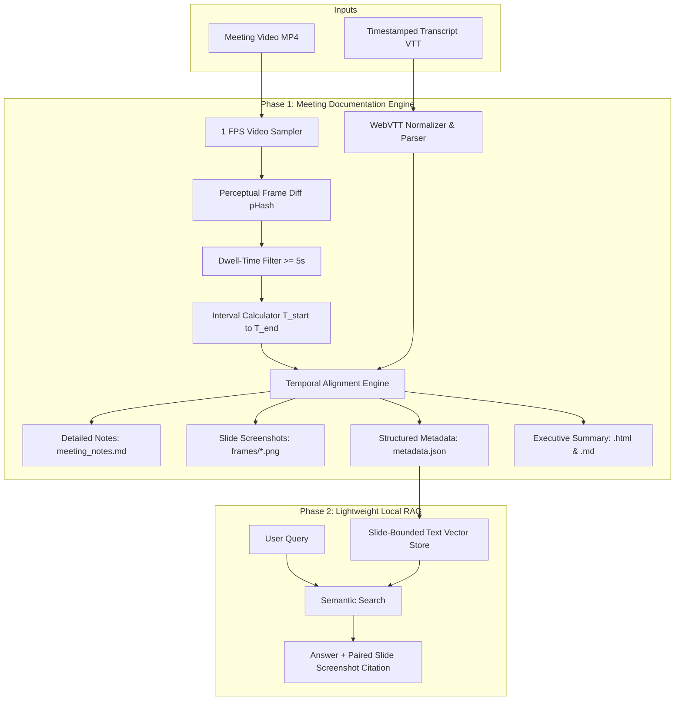

# Multimodal Meeting Documentation & Knowledge Base

A fast, lightweight, and privacy-first pipeline that transforms meeting video recordings (Microsoft Teams, Zoom, or YouTube presentations) and timestamped transcripts into:

1. **Interleaved Meeting Notes (`meeting_notes.md`):** Complete chronologically aligned record pairing every distinct presentation slide with its exact spoken dialogue.
2. **Executive Briefs (`executive_summary.html` & `.md`):** Thematic, high-level summary grouping micro-slides into major chapters with key takeaways and representative slide visuals.
3. **Structured Vector Dataset (`metadata.json`):** Topic-bounded chunks with timestamp intervals and image links, ready for Phase 2 local AI search.

---

## ⚡ Key Highlights

- **Zero Heavy Image Processing:** No complex vision encoders or heavy OCR required. Screenshots serve as verifiable visual citations paired with fast semantic text search.
- **Lightweight & Fast:** Runs on standard CPUs; samples video at 1 FPS with perceptual hashing (`pHash`) to detect slide changes in seconds.
- **Intelligent Stability Filtering:** Automatically filters out transient animations, rapid scrolling, and mouse movements using dwell-time thresholds.
- **Standard Format Ingestion:** Natively parses WebVTT (`.vtt`) files from Teams, Zoom, or YouTube captions.

---

## 🏗️ System Architecture



---

## 📁 Repository Structure

```text
meeting_Documentation/
├── process_meeting.py        # Core Phase 1 extraction and documentation engine
├── setup.sh                  # One-click environment installer & setup script
├── requirements.txt          # Python library dependencies
├── README.md                 # Project documentation & usage guide
├── Project_Blueprint_and_Implementation_Plan.md # In-depth technical architecture
│
├── sample/                   # Test sample data
│   ├── sample_meeting.mp4    # 10-minute conference presentation recording
│   └── sample_meeting.en.vtt # Aligned WebVTT transcript
│
└── output/                   # Generated meeting knowledge bases
    └── sample_meeting/
        ├── meeting_notes.md       # Full interleaved transcript with slides
        ├── executive_summary.md   # High-level chapter-by-chapter brief (Markdown)
        ├── executive_summary.html # Self-contained styled browser/PDF report
        ├── metadata.json          # Structured dataset for Phase 2 RAG
        └── frames/                # Extracted, timestamp-labeled slide screenshots
            ├── sample_meeting_frame_001_00m00s_to_00m34s.png
            ├── sample_meeting_frame_002_00m34s_to_01m27s.png
            └── ...
```

---

## 🛠️ Prerequisites & Installation

### 1. Prerequisites
- **Operating System:** Linux, macOS, or Windows (WSL recommended).
- **Python:** Python 3.9 or newer.
- **FFmpeg:** Installed on your system (`sudo apt install ffmpeg` on Ubuntu/Debian).

### 2. One-Click Setup
Clone or navigate to the project directory and run:

```bash
chmod +x setup.sh
./setup.sh
```

This will automatically create a clean virtual environment in `./venv` and install all necessary dependencies (`opencv-python-headless`, `pillow`, `imagehash`, `webvtt-py`).

---

## 🚀 Usage

### Basic Execution
To process any video and transcript, run:

```bash
./venv/bin/python3 process_meeting.py \
  --video path/to/meeting.mp4 \
  --vtt path/to/transcript.vtt \
  --output-dir ./output \
  --title "Meeting Title"
```

### Command-Line Arguments

| Argument | Required | Default | Description |
| :--- | :--- | :--- | :--- |
| `--video` | **Yes** | — | Path to the meeting recording MP4 file. |
| `--vtt` | **Yes** | — | Path to the WebVTT (`.vtt`) transcript file. |
| `--output-dir` | No | `./output` | Base directory to save the output meeting folder. |
| `--title` | No | Video filename | Human-readable title for document headers. |
| `--threshold` | No | `12` | Perceptual hash Hamming distance for slide detection (typically `10`–`16`). |
| `--min-dwell` | No | `5.0` | Minimum duration in seconds a slide must remain on screen before a transition is recorded. |

---

## 📊 Tuning Parameters

* **`--threshold` (Sensitivity):**
  * Use **`10`–`12`** for presentations where consecutive slides share the exact same template/background and only center text or bullet points change.
  * Use **`16`–`20`** for high-level scene changes or when you only want major chapter transitions.
* **`--min-dwell` (Animation Filter):**
  * Controls the minimum time (in seconds) a slide must stay visible. Setting this to `5.0` prevents transition animations, window resizing, or mouse scrolling from generating duplicate frames.

---

## 📄 Output Artifacts Explained

1. **`meeting_notes.md`**:
   Comprehensive reference document. Contains every detected slide with its active time window (`[MM:SS - MM:SS]`) and the complete, cleaned list of spoken dialogue points during that interval.
2. **`executive_summary.html`**:
   Interactive, modern, single-file HTML report. Formats the meeting into high-level thematic chapters with comparative matrices, key takeaways, and embedded images. Open directly in any browser or print to PDF.
3. **`executive_summary.md`**:
   The executive summary in portable GitHub-flavored Markdown for Notion, Obsidian, or Wiki pages.
4. **`metadata.json`**:
   Clean JSON manifest containing segment start/end seconds, relative image paths, and combined dialogue blocks. Acts as the ingestion source for Phase 2 semantic retrieval.

---

## 🔮 Phase 2 Roadmap: Local AI Chatbot

With Phase 1 complete and `metadata.json` generated:
- Ingest `metadata.json` into a local vector database (**ChromaDB** or **LanceDB**).
- Connect a local text LLM (**Ollama** with `llama3.2` or `qwen2.5`).
- Query: *"What was discussed regarding regional teacher training?"*
- Response: Answers using spoken dialogue while embedding the exact screenshot and timestamp for instant visual verification.
