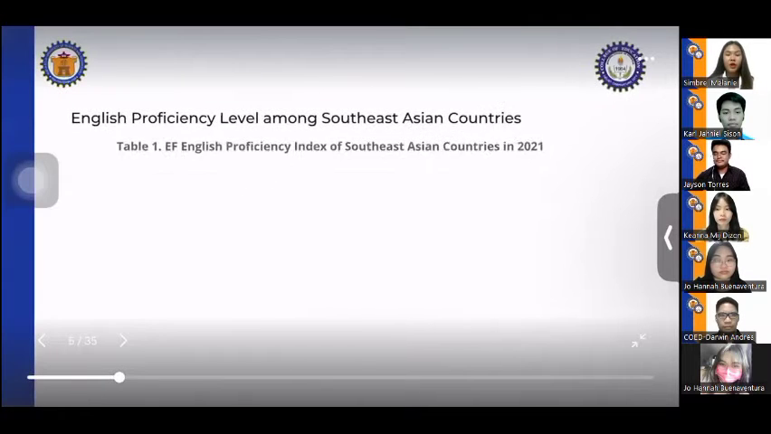

# Executive Brief: English Language Proficiency Curricula in Southeast Asia

**Conference:** International Conference in Innovation and Educational (Open University of Thailand)  
**Session Topic:** Comparative Analysis of English Language Education Curricula in ASEAN  
**Total Duration:** 10 Minutes, 6 Seconds  
**Source Recording:** `sample_meeting.mp4`

---

## Executive Overview (TL;DR)

This research presentation investigates the disparity in English language proficiency across the 11 Southeast Asian nations based on the **EF English Proficiency Index (EF EPI) 2021**. While countries like **Singapore, the Philippines, and Malaysia** consistently achieve high or very high proficiency, other regional peers lag in low or very low proficiency bands. 

Using **Bradley’s Effectiveness Model for Curriculum Development**, the study contrasts starting grade levels, instructional hours, pedagogical frameworks, and pre-service teacher education. The primary takeaway is that high proficiency is driven not merely by classroom hours, but by **early immersion (Grade 1 start), bilingual/multiliteracy curriculum design, experiential learning, and specialized pre-service teacher training**.

---

## Key Highlights & Comparative Metrics

| Dimension | High Proficiency Countries (Singapore, Philippines, Malaysia) | Low / Emerging Proficiency Countries (e.g., Vietnam, Laos, Cambodia) |
| :--- | :--- | :--- |
| **Starting Grade** | Grade 1 (early exposure) | Grade 3 to Grade 4 |
| **Curriculum Framework** | Bilingual immersion, Multiliteracies, Communicative tasks | Grammar/Vocabulary memorization, Accuracy over fluency |
| **Teacher Training** | Dedicated subject-matter specialization | Generalist pre-service training without English specialization |
| **Pedagogy** | Learner-centered, experiential, contextual | Traditional teacher-directed instruction |

---

## Chapter-by-Chapter Meeting Walkthrough

### 1. Research Problem & Core Questions [00:00 - 01:57]

#### The Gist:
English proficiency is a key economic driver in Southeast Asia, but EF EPI annual benchmark results reveal stark polarization across the region. To understand why this performance gap persists, the researchers formulated three guiding questions:
1. What is the baseline proficiency distribution across ASEAN countries in the EF EPI 2021?
2. What structural differences exist across their respective national English education curricula?
3. Which specific curricular features systematically foster high English proficiency?

> **Key Takeaway:** The study sets out to establish empirical links between national curriculum policy and standardized proficiency rankings.

---

### 2. Theoretical Framework & Methodology [01:57 - 02:37]

#### The Gist:
The analysis is anchored on **Bradley’s Effectiveness Model for Curriculum Development**. The researchers evaluated each nation's curriculum across four core dimensions:
* **Curriculum Design & Planning:** Starting age, scheduled contact hours, and official syllabi.
* **Pre-Service Teacher Preparation:** Degree of subject specialization in university teacher training.
* **Instructional Implementation:** Primary teaching methodologies applied in the classroom.
* **Measurable Outcomes:** Standardized performance in the EF EPI rankings.

> **Key Takeaway:** Curriculum quality is assessed holistically—from national policy down to teacher preparation and classroom execution.

---

### 3. Regional Proficiency Landscape (EF EPI 2021) [02:37 - 03:06]

#### The Gist:
The presentation details the official 2021 ranking table:
* **Very High / High Proficiency:** **Singapore** ranks #1 in the region (and #4 globally with an 84-point score), followed by the **Philippines** (2nd) and **Malaysia** (3rd).
* **Moderate to Low Bands:** Indonesia, Myanmar, and Vietnam sit in intermediate bands.
* **Very Low Proficiency Bands:** Thailand, Cambodia, and Laos placed in the lower tiers.

> **Key Takeaway:** Singapore stands out as a global benchmark, while a significant gap separates the top 3 ASEAN nations from the rest of the bloc.

---

### 4. Curriculum Structure: Starting Grade & Teaching Hours [03:06 - 04:33]

#### The Gist:
Comparing the structural requirements of all 11 ASEAN educational systems highlighted major disparities:
* **Starting Grade:** 7 out of 11 countries introduce English in **Grade 1** (Singapore, Philippines, Malaysia, Brunei, Myanmar, Thailand, and Cambodia). In contrast, Vietnam begins in **Grade 3**, and Laos begins in **Grade 4**.
* **Instructional Hours:** Total hours range widely; however, instructional volume alone does not guarantee high scores (e.g., Thailand introduces English early and allocates substantial hours, but faces systemic delivery bottlenecks).
* **Teacher Preparation:** In several lower-scoring countries, elementary teacher training is generalist, meaning educators teaching English often lack formal English subject specialization.

> **Key Takeaway:** Early introduction (Grade 1) is a necessary foundation, but must be paired with specialized teacher training to be effective.

---

### 5. Pedagogical Frameworks: Immersion vs. Grammar Focus [04:33 - 06:45]

#### The Gist:
The presenter compared national teaching approaches across the member states:
* **Bilingual Immersion:** Singapore and Brunei employ English as a primary medium of instruction across subjects.
* **Multiliteracies & MTB-MLE:** The Philippines utilizes a K-12 Mother Tongue-Based Multilingual Education system transitioning into a Language Arts and Multiliteracies curriculum.
* **Communicative & Experiential (CLT):** Laos and Indonesia emphasize communicative and learner-centered approaches.
* **Form-Focused Instruction:** Vietnam’s curriculum historically placed heavier emphasis on vocabulary lists, grammar accuracy, and memorization over oral fluency.

> **Key Takeaway:** Curricula prioritizing communication, immersion, and multiliteracy consistently outperform systems focused strictly on grammar accuracy.

---

### 6. Critical Success Factors of High-Performing Curricula [06:45 - 08:23]

#### The Gist:
Synthesizing the evidence, the presenter identified four cornerstone practices that distinguish top-performing curricula:
1. **Early Immersion:** Introducing English from early primary schooling with meaningful bilingual usage.
2. **Contextual & Experiential Learning:** Moving away from rote learning toward task-based interaction.
3. **Structured Language Arts Syllabi:** Incorporating reading, critical thinking, and multiliteracies.
4. **Continuous Teacher Upskilling:** Ongoing in-service professional development for language educators.

> **Key Takeaway:** Systemic success requires combining early immersion with progressive pedagogy and continuous educator training.

---

### 7. Recommendations for Educational Policymakers [08:23 - 10:06]

#### The Gist:
The presentation concludes with actionable recommendations for ASEAN ministries of education:
1. **Active Benchmarking:** Continue participating annually in EF EPI to diagnose national performance shifts.
2. **Curricular Reform:** Countries in the lower proficiency bands should adapt successful models from regional peers (e.g., bilingual education and communicative language teaching).
3. **Teacher Capacity Building:** Prioritize pre-service English specialization and continuous professional development for primary educators.

---

*Report prepared from automated meeting documentation pipeline (`process_meeting.py`).*
