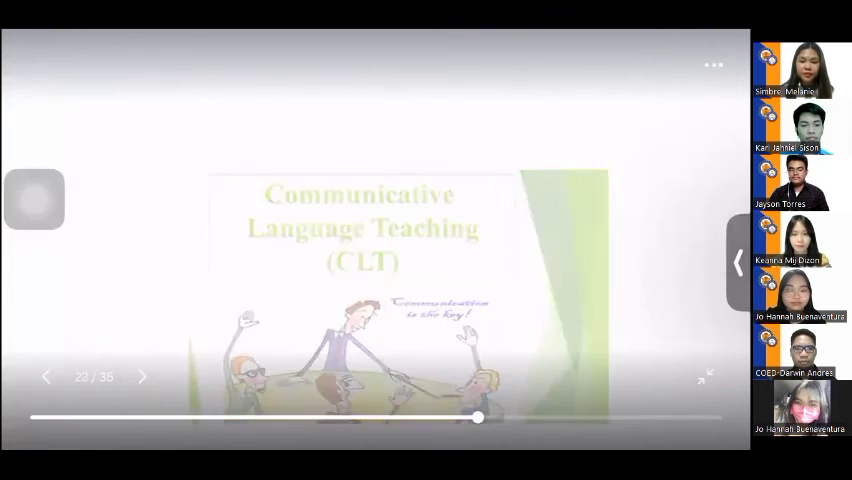

# Executive Brief: International Conference Presentation: English Language Proficiency

- **Meeting Name:** `sample_meeting`
- **Total Duration:** 10:06
- **Processed Slides:** 45
- **AI Model:** `llama3.2:latest` (Local via Ollama)

---

## Executive Overview (TL;DR)

Here is a concise 3-4 sentence Executive Summary:

The study examined the English language proficiency curricula in Southeast Asian countries, analyzing data from the EF English Proficiency Index (EF EPI) 2021. The results showed that countries like Singapore, Philippines, and Malaysia have high English proficiency levels, while Vietnam and Indonesia have low proficiency levels. The study also found that countries starting English instruction at an earlier grade level and teaching more hours tend to achieve higher English proficiency levels. However, other factors such as colonial history and teacher expertise may also influence English proficiency outcomes.

---

## Chapter Walkthrough

### 1. Overview of English Language Proficiency in Southeast Asian Countries [00:00 - 03:06]

**The Gist:**
- The EF English Proficiency Index (EF EPI) 2021 provides a framework for measuring English language proficiency in Southeast Asian countries.
- The study aims to describe the English language proficiency level of Southeast Asian countries based on the EF EPI 2021 and identify significant features of curricula that contribute to high English proficiency levels.
- The researchers examined the curricular implementation of five Southeast Asian countries over the past five years, using the Effectiveness model for curriculum development indicators.

> **Key Takeaway:** **Southeast Asian countries with high English proficiency levels require curriculum adjustments to address gaps in implementation and ensure effective teaching methods are adopted.**

---

### 2. English Education in Southeast Asia: A Comparative Analysis [03:06 - 04:59]

**The Gist:**
- Eleven Southeast Asian countries were analyzed for their English curricula implementation.
- Four countries started English instruction at grade 7 (Indonesia, Cambodia, Laos, and Timor-Leste), while seven countries started at grade 1 (Singapore, the Philippines, Malaysia, Myanmar, Thailand, Brunei, and Vietnam).
- Countries that started English instruction at an earlier level generally had higher teaching hours, but this was not the case for Thailand and Myanmar, which achieved lower proficiency levels despite earlier start.

> **Key Takeaway:** **Early start of English instruction does not guarantee higher English proficiency, and other factors such as colonial history, teacher expertise, and language acquisition difficulties should be considered when evaluating English education in Southeast Asia.**

---

### 3. Bilingual Education Systems in Southeast Asia [04:59 - 06:25]

**The Gist:**
- The region has implemented various bilingual education systems, with Singapore, Thailand, and Brunei adopting a bilingual approach, while the Philippines adopted a mother tongue-based multilingual education system.
- Malaysia, Indonesia, Cambodia, and Vietnam have applied the communicative language teaching approach, with Indonesia also incorporating learner-centered and experience-based instruction.
- The Philippines' educational system focuses on limiting the number of words to be learned in each grade, with Vietnam's system emphasizing a more limited vocabulary.

> **Key Takeaway:** **The effective implementation of bilingual education systems in Southeast Asia requires a tailored approach to language instruction, taking into account the unique cultural and linguistic contexts of each country.**

---

### 4. Effective Language Education Strategies [06:25 - 07:58]

**The Gist:**
- The English curriculum in Myanmar is based on the Common European Framework of Reference for Languages, ensuring context-based English language instruction.
- The bilingual education system in Singapore has shown a significant increase in residents speaking both English and other languages, from 13.5% in 2000 to 48.3% in 2020.
- The Philippines' Language and Arts Multiliteracy curriculum aligns with John PJ's development learning theory, using a spiral progression approach to develop children's language skills.

> **Key Takeaway:** **Implementing context-based language instruction and multiliteracy approaches can lead to significant improvements in English language proficiency and overall student development.**

---

### 5. Comparative Analysis of English Education in Southeast Asian Countries [07:58 - 09:20]

**The Gist:**
- Southeast Asian countries share a common practice of revising their English curricula for continuous development and improvement.
- The number of teaching hours is positively correlated with students' proficiency levels, with earlier English instruction starting at a higher proficiency level.
- Factors such as colonial history and teachers' expertise can influence English education curricula, which can be studied and potentially adopted by other countries.

> **Key Takeaway:** **Continuously revising and improving English curricula can lead to better student outcomes, and adopting best practices from other countries can help enhance English education in Southeast Asia.**

---

### 6. Recommendations for English Language Education [09:20 - 10:06]

**The Gist:**
- Southeast Asian countries are encouraged to participate in the EF Epi program for continuous monitoring and improvement.
- Countries with lower proficiency may recognize and adopt pictures of their existing curricula that can be improved.
- Countries with lower proficiency may consider adopting significant features of English curricula from high-performing Southeast Asian countries.

> **Key Takeaway:** **Participating in the EF Epi program and adopting best practices from high-performing countries can significantly improve English language education in Southeast Asian countries.**

---
