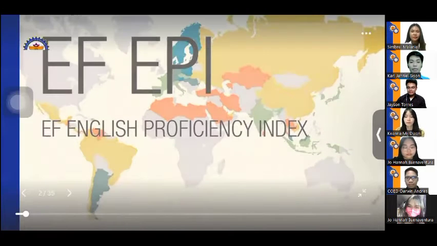
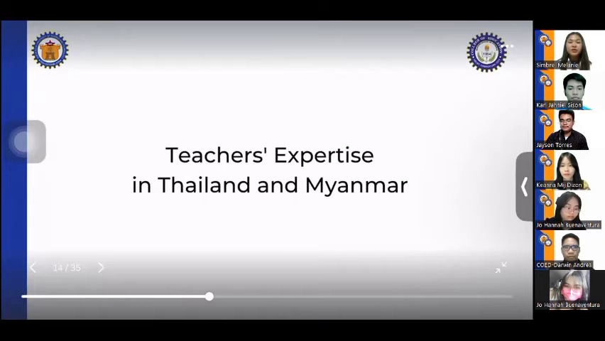
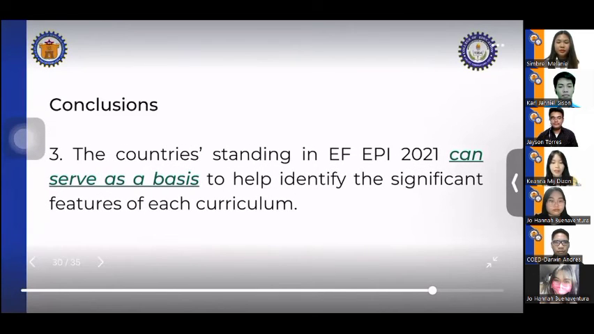

# Executive Brief: International Conference Presentation: English Language Proficiency

- **Meeting Name:** `sample_meeting`
- **Total Duration:** 10:06
- **Total Raw Slides:** 45
- **Informative Slides Documented:** 19
- **AI Engine:** `llama3.2:latest` (Local via Ollama)

---

## Executive Overview (TL;DR)

Here is a concise, professional 3-4 sentence Executive Summary:

This study examined English language proficiency curricula in Southeast Asian countries, analyzing data from the EF English Proficiency Index (EF EPI) 2021. Key findings indicate that countries starting English instruction at an earlier grade level (e.g., Singapore, Philippines, Malaysia) tend to achieve higher levels of proficiency, while those starting at a later grade level (e.g., Vietnam, Indonesia) lag behind. The study also highlights the impact of factors such as colonial history, teacher expertise, and limited resources on English language proficiency outcomes. Overall, the research suggests that tailored curriculum approaches and teacher support are crucial for achieving high English proficiency levels in Southeast Asian countries.

---

## Clean Slide-by-Slide Walkthrough (No Blanks / No Duplicates)

### Slide 01: Introduction to International Conference Presentation [00:00 - 00:34]

**The Gist:**
- The presentation is being held at the International Conference in Innovation and Education hosted by the prestigious Open University in Thailand.
- The research focuses on English language proficiency curricula in Southeast Asian countries.

> **Key Takeaway:** The speakers are honored to present their research on English language proficiency in a global platform, highlighting its importance for Southeast Asian countries.

---

### Slide 02: Observations on the EF English Proficiency Index in Southeast Asia [00:34 - 01:27]

**The Gist:**
- The EF English proficiency index (EFEPi) is a globally published result that measures English language proficiency of countries in Southeast Asia annually.
- Almost all Southeast Asian countries participate in the EFEPi, with a notable trend of maintaining high or very high proficiency levels.

> **Key Takeaway:** The researchers aim to investigate the English language proficiency curriculum among Southeast Asian countries to understand the factors contributing to the observed trends in EFEPi results.

---

### Slide 04: English Language Proficiency in Southeast Asian Countries [01:27 - 01:57]

**The Gist:**
- The EF English Proficiency Index 2021 shows that Southeast Asian countries have varying levels of English proficiency, with some countries performing better than others.
- Observations of the English education curriculum in Southeast Asian countries reveal a focus on teaching English as a foreign language, with an emphasis on grammar, vocabulary, and listening skills.
- Significant features of curricula in Southeast Asian countries contributing to high English proficiency levels include the use of standardized tests, such as TOEFL and IELTS, and the incorporation of technology-enhanced learning tools.

> **Key Takeaway:** Southeast Asian countries' English education curricula are showing promise in producing citizens with high English proficiency levels, but further analysis is needed to identify best practices and areas for improvement.

---

### Slide 06: Study Background and Methodology [01:57 - 02:32]

**The Gist:**
- The study is based on the EF Epi 2021 Accord and the theory of Bradley's Effectiveness model for curriculum development indicators.
- The researchers examined a curricular implementation from five years ago, using data from EF Epi 2021 as a reference point.

> **Key Takeaway:** The study leverages existing data and theoretical frameworks to analyze a past curriculum implementation, employing a data mining approach to gather insights.

---

### Slide 08: English Proficiency Results of Southeast Asian Countries in 2021 [02:32 - 03:06]

**The Gist:**
- Singapore had the highest level of English proficiency
- Philippines and Malaysia had high levels of proficiency
- Vietnam and Indonesia had low levels of proficiency
- Myanmar, Cambodia, and Thailand had very low proficiency
- Brunei, Laos, and Timor-Lester were excluded from the results due to non-participation in ESETI 2024

> **Key Takeaway:** The study highlights significant variations in English proficiency among Southeast Asian countries, with some nations performing much better than others.

---

### Slide 09: Southeast Asian Countries List [03:06 - 03:11]

**The Gist:**
- The list includes 11 Southeast Asian countries.
- The countries are: [list of countries not specified in the dialogue]

> **Key Takeaway:** The slide appears to be setting the stage for a discussion about Southeast Asia, but the specific countries are not mentioned.

---

### Slide 12: English Education in Southeast Asia: Teaching Hours and Proficiency [03:11 - 04:28]

**The Gist:**
- Six countries (Singapore, Philippines, Malaysia, Myanmar, Thailand, and Brunei) started English instruction at grade one.
- Four countries (Indonesia, Cambodia, Laos, and Timor-Leste) started English instruction at grade seven.
- Vietnam started English education at grade 3.
- The number of teaching hours varies among Southeast Asian countries, but those starting English at an earlier level tend to have higher teaching hours.

> **Key Takeaway:** While starting English education at an earlier level is associated with higher teaching hours, it does not guarantee higher English proficiency, suggesting that other factors such as colonial history and teacher expertise may also play a role.

---

### Slide 14: Challenges in English Language Acquisition in Myanmar [04:28 - 04:54]

**The Gist:**
- Myanmar was not colonized by English-speaking countries.
- The main language in Myanmar is Burmese.
- Studies revealed additional difficulties in acquiring the English language.
- Myanmar did not offer specialized courses as part of their education system.

> **Key Takeaway:** The lack of English language exposure and specialized education in Myanmar may contribute to difficulties in English language acquisition, highlighting the need for targeted language support initiatives.

---

### Slide 16: Challenges in Teacher Education in Thailand [04:54 - 05:39]

**The Gist:**
- In Thailand, student teachers were unable to focus on attaining expertise in specific subjects like English.
- The country had a limited number of English teachers, leading some teachers to teach concepts beyond their expertise.

> **Key Takeaway:** A training program launched in 2016 by Kailan and the British Council improved the expertise and strategies of English teachers in Thailand, setting the stage for further teacher training.

---

### Slide 21: Teaching Approaches in Southeast Asian Countries [05:39 - 06:20]

**The Gist:**
- Singapore, Thailand, and Brunei implemented the bilingual education system.
- The Republic of the Philippines adopted the K-12 curriculum with mother tongue-based multilingual education.
- Malaysia, Indonesia, Cambodia, and other countries applied the communicative language teaching approach.
- Indonesia also used learner-centered and experience-based instruction, incorporating the use of students' native language as a medium of instruction.

> **Key Takeaway:** The diverse teaching approaches in Southeast Asia highlight the need for a tailored approach to language education that considers the unique cultural and linguistic contexts of each country.

---

### Slide 23: Comparative Analysis of English Language Education in Southeast Asia [06:20 - 06:40]

**The Gist:**
- Vietnam's educational system prioritized accuracy over fluency in language learning.
- Myanmar's English curriculum was based on the Common European Framework of Reference for Languages.

> **Key Takeaway:** Understanding the differences in English language education approaches among Southeast Asian countries can inform strategies for effective language instruction.

---

### Slide 25: Bilingual Education System in Singapore [06:40 - 07:17]

**The Gist:**
- The percentage of residents in Singapore who speak both English and another language has increased by 13.5% from 2000 to 2010.
- The percentage has further increased to 48.3% in 2020, according to a report by Language Magazine.

> **Key Takeaway:** The bilingual education system in Singapore is showing significant growth in language proficiency, indicating a strong trend towards multilingualism in the country.

---

### Slide 27: Alignment of Language and Arts Multiliteracy Curriculum with Timeless Learning Theory [07:17 - 07:38]

**The Gist:**
- The language and arts multiliteracy curriculum in the Philippines is aligned with John PJ's development learning theory.
- The curriculum applies a spiral progression way of learning, which well develops children's cognitive skills in language.

> **Key Takeaway:** The use of a spiral progression learning approach in the multiliteracy curriculum may be effective in developing children's language skills, suggesting a potential best practice in education.

---

### Slide 29: Malaysia English Language Program Benefits [07:38 - 07:53]

**The Gist:**
- The activities in Malaysia will improve students' English speaking skills
- The program will also enhance students' English grammar skills, vocabulary skills, and pragmatic competence

> **Key Takeaway:** Implementing the Malaysia English Language Program is expected to yield significant improvements in students' English language proficiency.

---

### Slide 31: Comparison of English Instruction in Southeast Asian Countries [07:53 - 08:03]

**The Gist:**
- Earlier English instruction is a significant feature in some Southeast Asian countries.
- No specific details on the other countries are mentioned.

> **Key Takeaway:** The presentation highlights the importance of early English instruction in some Southeast Asian countries, suggesting a potential area for comparison or discussion.

---

### Slide 36: Key Findings on English Curriculum Revision and Teaching Hours [08:03 - 09:04]

**The Gist:**
- South East Asian countries continuously revise their English curricula for further development or improvement.
- Countries with higher teaching hours have a higher possibility for students to achieve higher proficiency.
- Countries starting English instruction at an earlier level tend to yield students with higher proficiency.

> **Key Takeaway:** Effective English curriculum revision and sufficient teaching hours are crucial for improving student proficiency in the region.

---

### Slide 38: 2021 English Education Benchmarking [09:04 - 09:20]

**The Gist:**
- 2021 can serve as a basis to help identify significant features of each curriculum
- This can be adopted by other countries to Foster their English education

> **Key Takeaway:** Establishing a baseline for English education curricula in 2021 can provide valuable insights for other countries to improve their own English education systems.

---

### Slide 43: Recommendations for English Language Education in Southeast Asia [09:20 - 09:54]

**The Gist:**
- Southeast Asian countries may participate in the EF Epi program for continuous monitoring and improvement.
- Countries with lower proficiency may recognize and improve pictures from their existing curricula.
- Countries with lower proficiency may adopt significant features from English curricula in Southeast Asian countries that performed well.

> **Key Takeaway:** The presentation concludes with recommendations for English language education in Southeast Asia, emphasizing the importance of continuous improvement and adopting best practices from successful countries.

---

### Slide 45: Key Takeaway on English Language Education Contribution [09:54 - 10:06]

**The Gist:**
- The research is expected to have a significant impact on English language education globally.
- No specific numbers or countries are mentioned in this brief dialogue.

> **Key Takeaway:** The speaker emphasizes the potential of the research to make a substantial contribution to English language education worldwide.

---
