# Executive Brief: International Conference Presentation: English Language Proficiency

- **Meeting Name:** `sample_meeting`
- **Total Duration:** 10:06
- **Total Raw Slides:** 45
- **Fully-Filled Slides Documented:** 26
- **Filter Engine:** Pure Dynamic Computer Vision (Zero Hardcoding)
- **AI Engine:** `llama3.2:latest` (Local via Ollama)

---

## Executive Overview (TL;DR)

Here is a concise, professional 3-4 sentence Executive Summary:

This study examined the English language proficiency curricula in Southeast Asian countries, analyzing data from the EF English Proficiency Index (EF EPI) 2021. Key findings indicate that countries such as Singapore, the Philippines, and Malaysia have high English proficiency levels, while Vietnam and Indonesia have lower proficiency levels. The study also identified that countries starting English instruction at an earlier grade level and with longer teaching hours tend to achieve higher English proficiency levels. However, factors such as colonial history and teacher expertise also play a significant role in shaping English language proficiency outcomes in Southeast Asia.

---

## Clean Slide-by-Slide Walkthrough (Fully-Filled Slides Only)

### Slide 01: Introduction to International Conference [00:00 - 00:34]

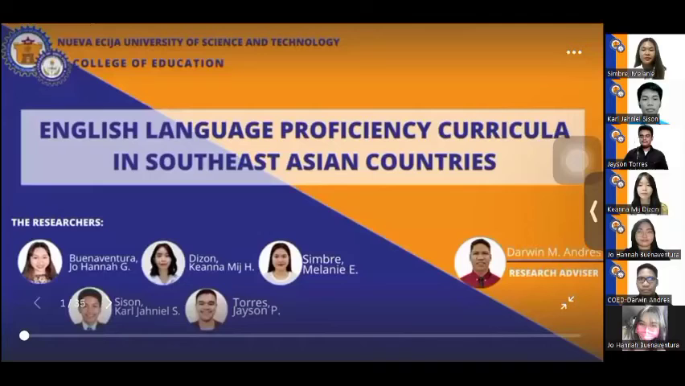

**The Gist:**
- The conference is hosted by the prestigious Open University in Thailand.
- The presentation will focus on English language proficiency curricula in Southeast Asian countries.

> **Key Takeaway:** The speakers will highlight the importance of English language proficiency in Southeast Asian countries, emphasizing its global advantages.

---

### Slide 03: Observations on EF English Proficiency Index in Southeast Asia [00:34 - 01:32]

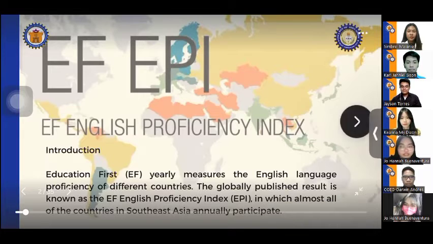

**The Gist:**
- Almost all Southeast Asian countries participate in the EF English proficiency index annually.
- Despite maintaining high or very high proficiency levels, some countries have been in the low or very low proficiency bands over the years.

> **Key Takeaway:** The study aims to investigate the English language proficiency curriculum among Southeast Asian countries to better understand the factors contributing to the variation in proficiency levels.

---

### Slide 04: English Education Curriculum in Southeast Asian Countries [01:32 - 01:57]

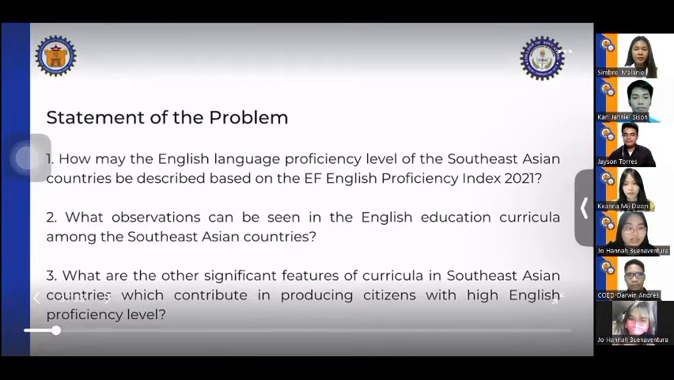

**The Gist:**
- The EF English proficiency index 2021 shows a range of proficiency levels among Southeast Asian countries.
- Observations indicate that English education curricula in Southeast Asian countries have varying features that contribute to producing citizens with high English proficiency levels.

> **Key Takeaway:** Southeast Asian countries' English education curricula have diverse features that impact their citizens' English proficiency levels, warranting further analysis to identify effective strategies for improvement.

---

### Slide 05: Study Data Source [01:57 - 02:02]

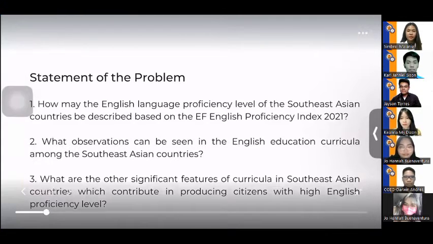

**The Gist:**
- Based on the European Food Safety Authority (EFSA)

> **Key Takeaway:** The study relies heavily on EFSA's data and conclusions for its findings.

---

### Slide 06: Overview of the Epi 2021 Accord on Curriculum Development Indicators [02:02 - 02:32]

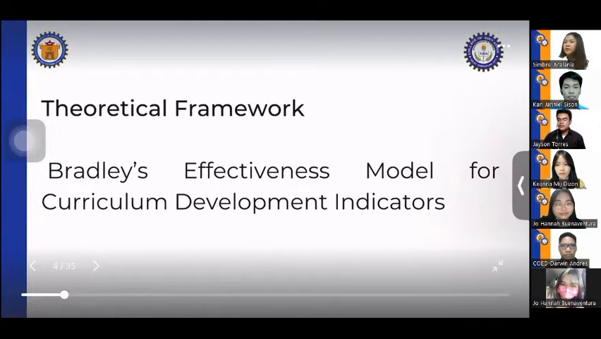

**The Gist:**
- The accord is based on the theory of Bradley's Effectiveness model for curriculum development.
- The curricular implementation being examined is from five years ago, likely an English curriculum from a certain country implemented at least five years ago.

> **Key Takeaway:** The researchers used a data mining approach to gather data for this study, suggesting a focus on analyzing existing data to inform curriculum development.

---

### Slide 09: English Proficiency Levels in Southeast Asian Countries (2021) [02:37 - 03:11]

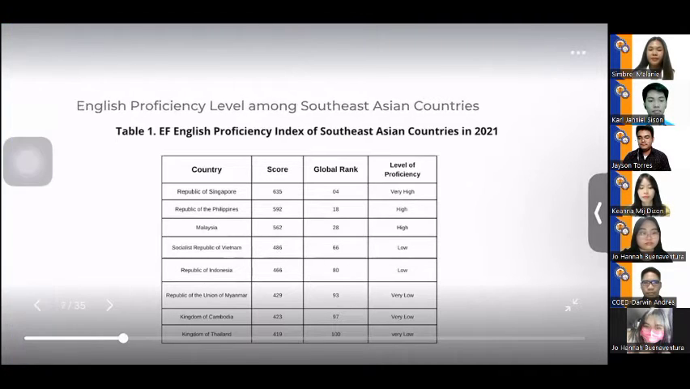

**The Gist:**
- Singapore has the highest level of English proficiency.
- Philippines and Malaysia have high levels of proficiency.
- Vietnam and Indonesia have low proficiency levels.
- Myanmar, Cambodia, and Thailand have very low proficiency levels.
- Brunei, Laos, and Timor-Leste were excluded from the table due to non-participation in ESETI 2024.

> **Key Takeaway:** English proficiency levels vary significantly across Southeast Asian countries, with some nations having high proficiency levels while others struggle with basic proficiency.

---

### Slide 12: English Education in Southeast Asia: Teaching Hours and Proficiency [03:11 - 04:28]

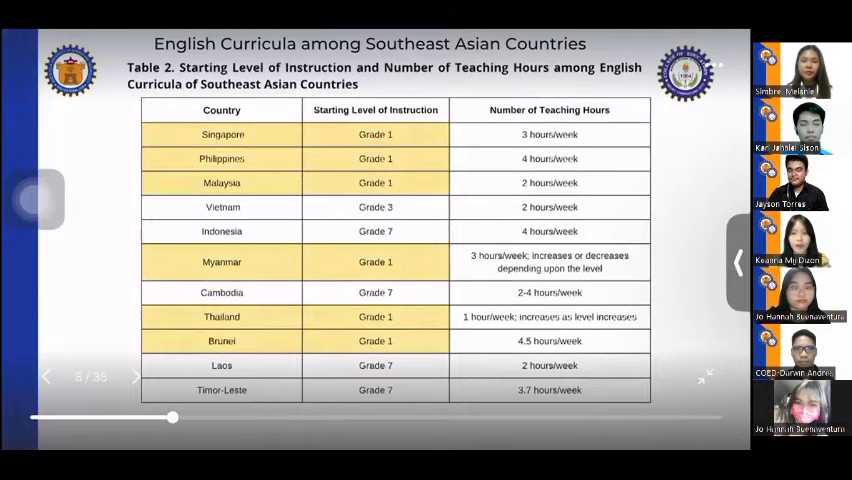

**The Gist:**
- Six countries (Singapore, Philippines, Malaysia, Myanmar, Thailand, and Brunei) started English instruction at grade one.
- Four countries (Indonesia, Cambodia, Laos, and Timor-Leste) started English instruction at grade seven.
- Vietnam started English education at grade 3.
- The number of teaching hours among Southeast Asian countries varied, but those that started earlier and taught longer hours achieved higher English proficiency.

> **Key Takeaway:** Early start to English education and longer teaching hours do not guarantee higher English proficiency in Southeast Asian countries, suggesting other factors such as colonial history and teacher expertise may play a significant role.

---

### Slide 14: Language Acquisition Challenges in Myanmar [04:33 - 04:54]

**The Gist:**
- Myanmar was not colonized by English-speaking countries.
- The main language in Myanmar is Burmese.
- Studies revealed additional difficulties in acquiring the English language.
- Myanmar did not offer specialized courses as part of their education system.

> **Key Takeaway:** The lack of English language exposure and specialized education in Myanmar may contribute to unique challenges in language acquisition.

---

### Slide 17: Challenges in Teacher Education in Thailand [04:59 - 05:44]

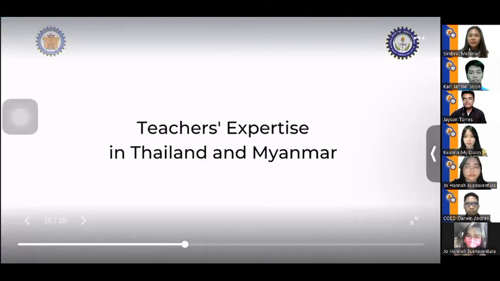

**The Gist:**
- In Thailand, student teachers struggled to focus on attained expertise in specific subjects like English.
- Due to limited English teachers, some teachers were forced to teach concepts beyond their expertise, including teaching younger students.

> **Key Takeaway:** A training program launched by Kailan in 2016 improved the expertise and teaching strategies of English teachers in Thailand, paving the way for better teacher training and education.

---

### Slide 18: Bilingual Education Implementation in Southeast Asia [05:44 - 05:49]

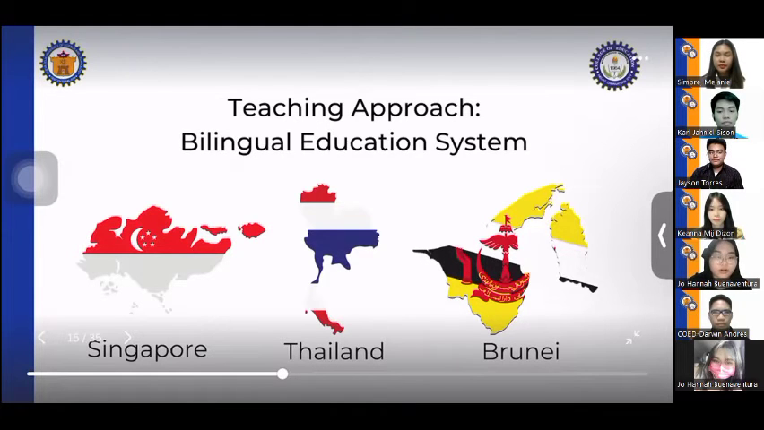

**The Gist:**
- Thailand and Brunei implemented the bilingual education system.
- The Republic of Brunei has also adopted this system.

> **Key Takeaway:** The implementation of bilingual education in Thailand and Brunei suggests a growing trend in Southeast Asia towards promoting language diversity and cultural exchange through education.

---

### Slide 20: Comparison of Education Systems in Southeast Asia [05:59 - 06:04]

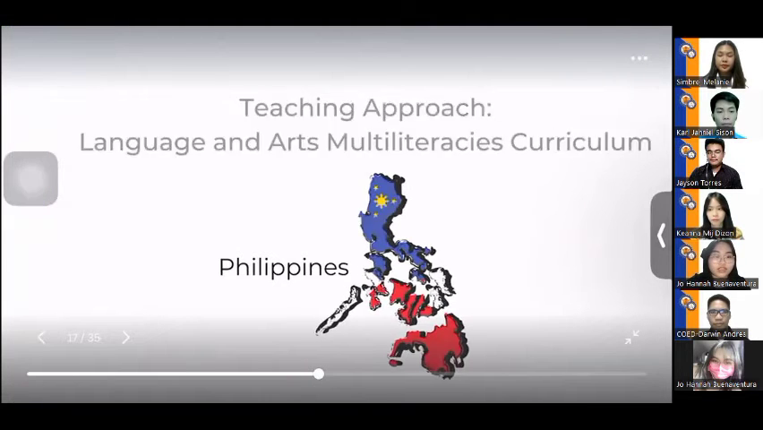

**The Gist:**
- The Philippines adopted the K-12 curriculum.
- Malaysia, Indonesia, and Cambodia applied the communicative language approach.

> **Key Takeaway:** The education systems in these Southeast Asian countries have adopted different approaches to language education, with the Philippines focusing on the K-12 curriculum and the others emphasizing communicative language.

---

### Slide 21: Teaching Approach in Indonesia [06:04 - 06:20]

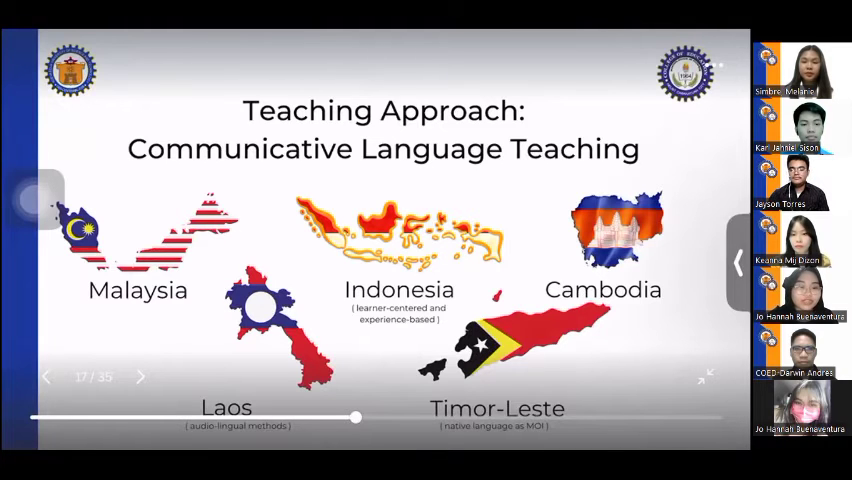

**The Gist:**
- Indonesia applied learner-centered and experience-based instruction
- The country used the ordering method and demolition approach
- Students' native language was used as the medium of instruction

> **Key Takeaway:** Indonesia's teaching approach emphasizes learner-centered and experiential learning, with a focus on utilizing students' native language to facilitate instruction.

---

### Slide 22: Vietnam's Educational System [06:20 - 06:25]

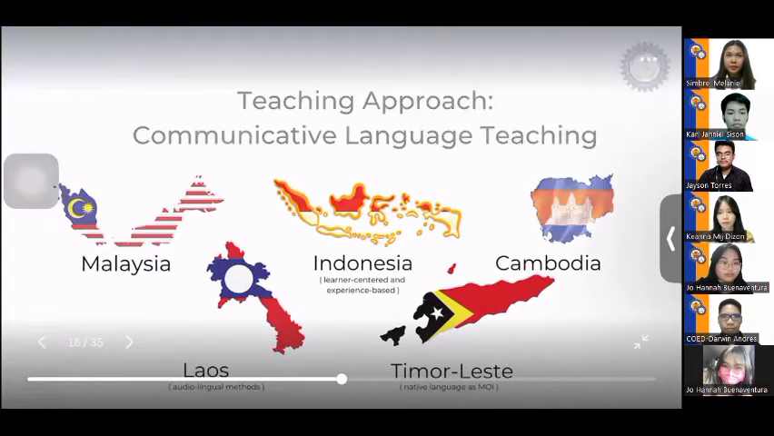

**The Gist:**
- Vietnam limited the words that must be learned in each grade
- Its educational system focused on

> **Key Takeaway:** Vietnam's educational system prioritizes a more streamlined approach to language learning, potentially indicating a focus on efficiency and effectiveness.

---

### Slide 23: Contextualization of English Language Education in Myanmar [06:25 - 06:40]

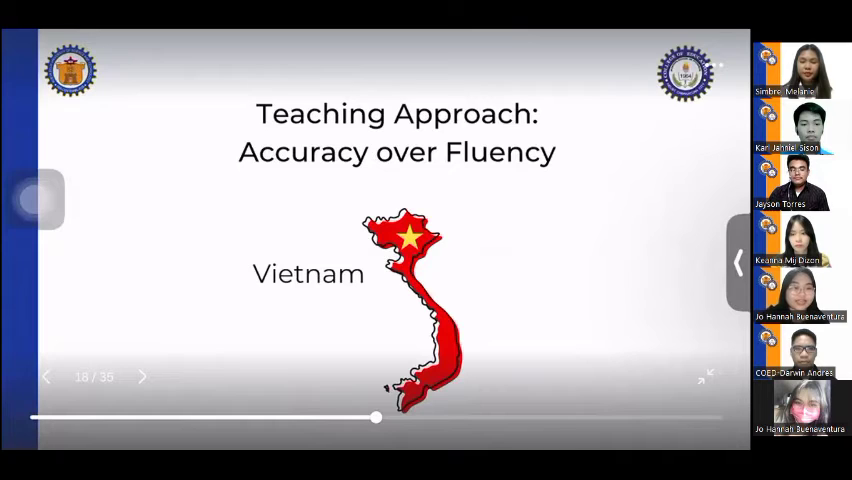

**The Gist:**
- The English curriculum in Myanmar was based on the Common European Framework of Reference for Languages (CEFR).
- The CEFR ensures that English language instruction is taught in context.

> **Key Takeaway:** The use of the CEFR framework provides a structured approach to teaching English in Myanmar, allowing for a more contextualized and effective language learning experience.

---

### Slide 25: Bilingual Education System in Singapore [06:45 - 07:17]

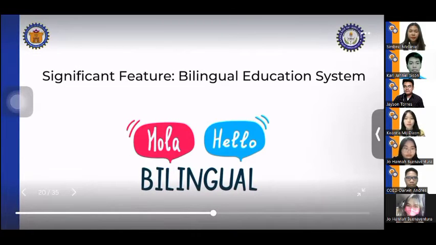

**The Gist:**
- The percentage of residents in Singapore who speak both English and another language has increased by 13.5% since 2000.
- The percentage has further increased to 48.3% in 2020, according to a report by Language Magazine.

> **Key Takeaway:** The bilingual education system in Singapore is showing significant growth in language proficiency, indicating a positive trend in language diversity and education.

---

### Slide 26: Language and Arts Curriculum Discussion [07:17 - 07:22]

**The Gist:**
- The discussion revolves around the language and arts multiliteracy curriculum.
- No specific details or statistics are mentioned.

> **Key Takeaway:** The slide suggests a general conversation about the language and arts curriculum, without providing concrete information or key takeaways.

---

### Slide 27: Alignment with Timeless Learning Theory [07:22 - 07:38]

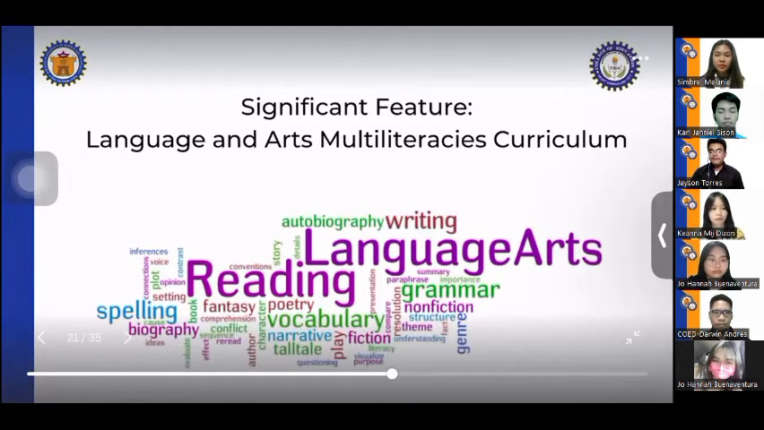

**The Gist:**
- The Philippines' education system is aligned with John PJ's development learning theory.
- The curriculum applies a spiral progression way of learning, which develops children's cognitive skills in language.

> **Key Takeaway:** The Philippines' education system is utilizing a learning approach that is consistent with a well-established theory, suggesting a structured and effective method for developing children's language skills.

---

### Slide 29: Malaysia English Language Program Benefits [07:43 - 07:53]

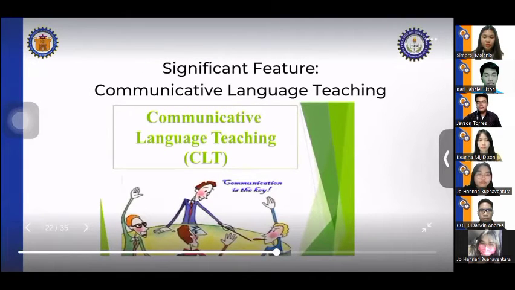

**The Gist:**
- Activities in Malaysia will improve students' English speaking skills
- The program will also enhance students' English grammar skills, vocabulary skills, pragmatic competence, and fluency

> **Key Takeaway:** Implementing the Malaysia English Language Program is expected to yield significant improvements in students' English language proficiency.

---

### Slide 31: Comparison of English Instruction in Southeast Asian Countries [07:58 - 08:03]

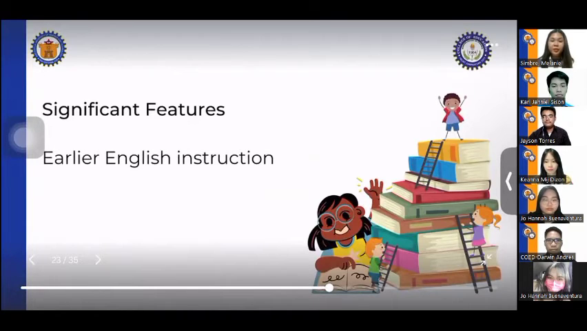

**The Gist:**
- Earlier English instruction in some Southeast Asian countries
- No specific details on the other countries mentioned

> **Key Takeaway:** The presentation highlights the variation in English instruction across Southeast Asian countries, suggesting that some countries may be adopting English instruction earlier than others.

---

### Slide 32: Instructional Approach Emphasis [08:03 - 08:08]

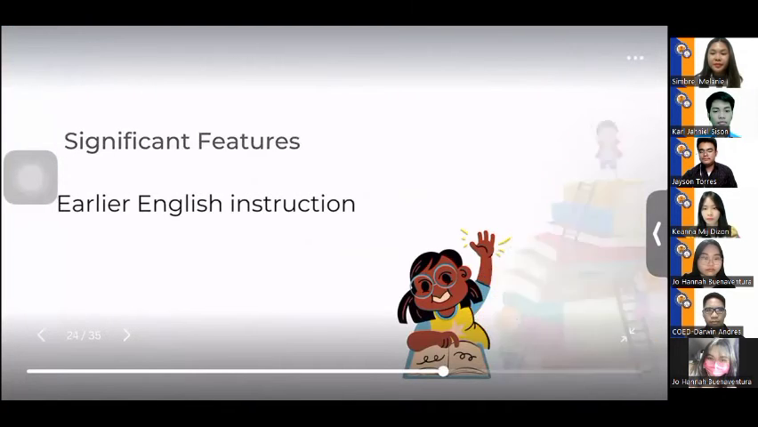

**The Gist:**
- The meeting emphasizes the importance of learner-centered and experience-based instruction.
- No specific numbers or countries are mentioned.

> **Key Takeaway:** The meeting highlights the value of personalized and experiential learning approaches, suggesting a shift away from traditional teaching methods.

---

### Slide 33: Slide 33: Content & Discussion [08:08 - 08:13]

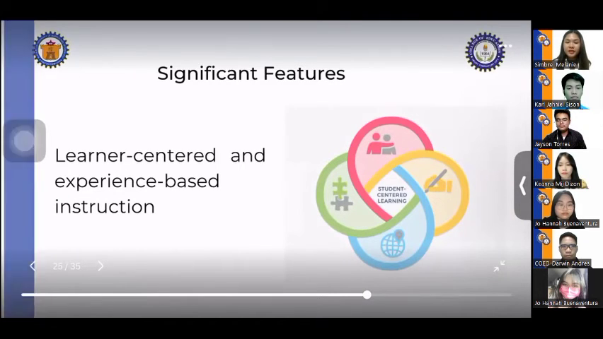

**The Gist:**
- I don't see any dialogue or topic information provided. Please provide the dialogue and topic information for the slide section, and I'll be happy to assist you in creating the executive slide-by-slid

> **Key Takeaway:** Key content and data points covered.

---

### Slide 35: Study Findings and Conclusion [08:18 - 08:23]

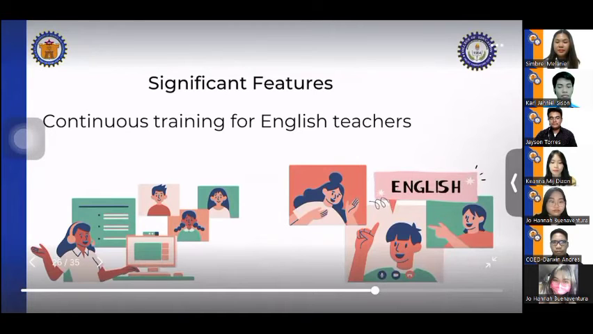

**The Gist:**
- Continuous training for English teachers was provided
- The study's findings led to the conclusion that provision of such training was necessary

> **Key Takeaway:** The study highlights the need for continuous training for English teachers, indicating a potential area for improvement in education.

---

### Slide 36: English Curriculum Revision Trends in South East Asian Countries [08:23 - 09:04]

**The Gist:**
- South East Asian countries continuously revise their English curricula for further development or improvement.
- Countries with higher teaching hours tend to yield students with higher proficiency.
- Countries with earlier English instruction levels also tend to produce higher-proficiency students.

> **Key Takeaway:** The effectiveness of English curriculum revisions in South East Asian countries is influenced by factors such as teaching hours and early English instruction levels, suggesting that targeted interventions can improve student proficiency.

---

### Slide 39: Key Takeaways from 2021 Research on English Education [09:09 - 09:25]

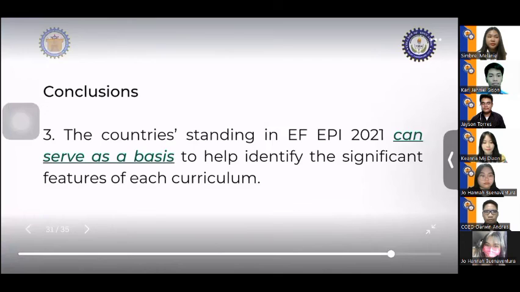

**The Gist:**
- Researchers used 2021 as a baseline to identify significant features of English curricula that can be adopted by other countries.
- The researchers have developed recommendations for English education.

> **Key Takeaway:** The study aims to provide a foundation for other countries to build upon when developing their own English education curricula.

---

### Slide 43: Southeast Asian Countries to Participate in EF Epi for Continuous Monitoring [09:25 - 09:54]

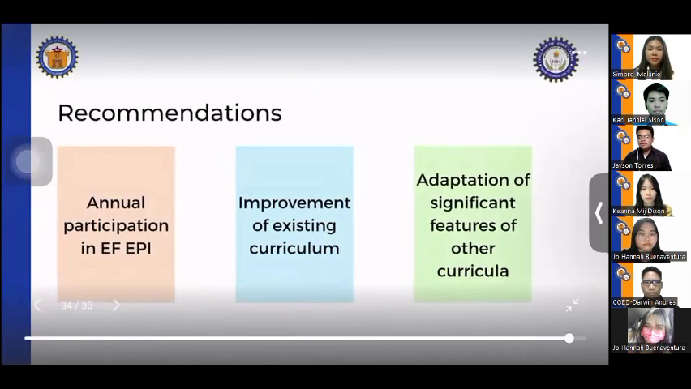

**The Gist:**
- Southeast Asian countries will participate in the EF Epi for continuous monitoring of improvement.
- Countries with lower proficiency will recognize pictures of their existing curricula that can be improved.
- Countries with lower proficiency may consider adopting significant features of English curricula in Southeast Asian countries that performed well.

> **Key Takeaway:** The presentation concludes that Southeast Asian countries will engage in the EF Epi to improve their English curricula, with a focus on adopting best practices from successful countries.

---

### Slide 45: Research Contribution to English Language Education [09:59 - 10:06]

**The Gist:**
- The researcher believes their work will have a significant impact on English language education globally.
- No specific numbers or countries are mentioned in this brief dialogue.

> **Key Takeaway:** The researcher is optimistic about the potential of their research to make a substantial contribution to the field of English language education worldwide.

---
