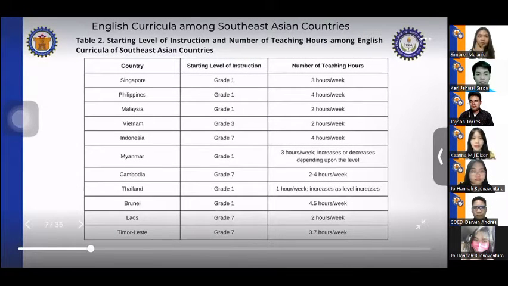
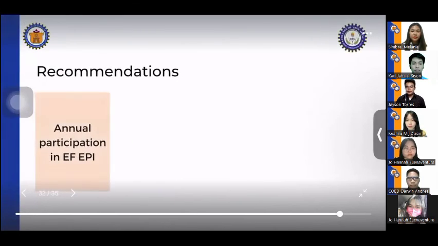

# Executive Brief: International Conference Presentation: English Language Proficiency

- **Meeting Name:** `sample_meeting`
- **Total Duration:** 10:06
- **Total Slides Extracted:** 45
- **Informative Slides Documented:** 26
- **AI Engine:** `llama3.2:latest` (Local via Ollama)

---

## Executive Overview (TL;DR)

Here is a clear and professional 3-4 sentence Executive Summary:

This study examined the English language proficiency curricula in Southeast Asian countries, using data from the EF English Proficiency Index (EF EPI) 2021. The results showed that while some countries, such as Singapore, the Philippines, and Malaysia, achieved high levels of English proficiency, others, including Vietnam, Indonesia, and Myanmar, struggled with low proficiency levels. The study found that countries that started English instruction at an earlier grade level and implemented more teaching hours tended to achieve higher levels of proficiency, but other factors, such as colonial history and teacher expertise, also played a significant role. The findings highlight the need for targeted interventions to improve English language proficiency in Southeast Asian countries.

---

## Detailed Slide-by-Slide Walkthrough

### Slide 01: Introduction to the International Conference [00:00 - 00:34]

**The Gist:**
- The presentation is taking place at the International Conference in Innovation and Education hosted by the prestigious Open University in Thailand.
- The organization is presenting research on English language proficiency curricula in Southeast Asian countries.

> **Key Takeaway:** The organization is highlighting the importance of English language proficiency in Southeast Asian countries, setting the stage for their research presentation.

---

### Slide 02: Observations on Southeast Asian Countries' English Language Proficiency [00:34 - 01:27]

**The Gist:**
- Almost all Southeast Asian countries participate in the EF English proficiency index annually.
- Despite maintaining high or very high proficiency levels, some countries have been in the low or very low proficiency bands over the years.

> **Key Takeaway:** The researchers aim to investigate the English language proficiency curriculum among Southeast Asian countries to better understand the factors contributing to the variation in proficiency levels among these nations.

---

### Slide 04: English Language Proficiency in Southeast Asian Countries [01:27 - 01:57]

**The Gist:**
- The EF English Proficiency Index 2021 ranks Southeast Asian countries in terms of English language proficiency.
- Observations show that English education curricula in Southeast Asian countries focus on producing citizens with high English proficiency levels.

> **Key Takeaway:** Southeast Asian countries prioritize English language education to enhance the proficiency levels of their citizens.

---

### Slide 05: Study Data Source [01:57 - 02:02]

**The Gist:**
- Based on the European Food Safety Authority (EFSA) for data and conclusions
- Results from EFSA were used to inform the study

> **Key Takeaway:** The study relies heavily on EFSA data, indicating a strong foundation for its conclusions and results.

---

### Slide 06: Overview of the Effectiveness Model for Curriculum Development [02:02 - 02:32]

**The Gist:**
- The study examined the effectiveness of a curriculum implemented five years ago.
- The data used in the study was likely from an English curriculum implemented by a certain country at least five years ago.

> **Key Takeaway:** The researchers used a data mining approach to gather data from an existing study, suggesting a potential for leveraging existing research to inform curriculum development.

---

### Slide 07: Study Results Table [02:32 - 02:37]

**The Gist:**
- The study has been completed and its results are now visible on the screen.
- The results are presented in a table format.

> **Key Takeaway:** The study's findings are now accessible for review and analysis.

---

### Slide 08: English Proficiency Levels in Southeast Asian Countries [02:37 - 03:06]

**The Gist:**
- Singapore had the highest English proficiency level in 2021.
- Philippines and Malaysia had high English proficiency levels.
- Vietnam and Indonesia had low English proficiency levels.
- Myanmar, Cambodia, and Thailand had very low English proficiency levels.
- Brunei, Laos, and Timor-Leste were excluded from the table due to non-participation in ESETI 2024.

> **Key Takeaway:** The English proficiency levels in Southeast Asian countries vary significantly, with some countries having high levels of proficiency while others struggle with basic language skills.

---

### Slide 09: Southeast Asian Countries List [03:06 - 03:11]

**The Gist:**
- 11 countries are listed
- The list includes Southeast Asian countries

> **Key Takeaway:** The list of Southeast Asian countries is provided, indicating a preliminary step in the presentation.

---

### Slide 10: English Curriculum Implementation Timeline [03:11 - 03:20]

**The Gist:**
- Six countries have started implementing their respective English curricula.
- The starting level of instruction and number of teaching hours vary across these countries.

> **Key Takeaway:** The implementation of English curricula is underway in six countries, indicating a shift towards standardized language education.

---

### Slide 12: English Education in Southeast Asia: Early Start and Teaching Hours [03:20 - 04:28]

**The Gist:**
- Four countries (Singapore, Philippines, Malaysia, and Myanmar) started English instruction at grade 7, while six countries (Indonesia, Cambodia, Laos, Timor-Leste, and Vietnam) started at grade 3.
- The number of teaching hours varied among Southeast Asian countries.

> **Key Takeaway:** While countries that started English education at an earlier level tend to have higher teaching hours, other factors such as colonial history and teacher expertise may also influence English proficiency levels.

---

### Slide 14: Challenges in English Language Acquisition in Myanmar [04:28 - 04:54]

**The Gist:**
- Myanmar was not colonized by English-speaking countries, unlike the Philippines and Singapore.
- The main language in Myanmar is Burmese, which is associated with additional difficulties in acquiring the English language.
- Myanmar did not offer specialized courses as part of their education system.

> **Key Takeaway:** The lack of English language exposure and specialized education in Myanmar may contribute to difficulties in English language acquisition, highlighting the need for targeted language support initiatives.

---

### Slide 16: Challenges in Teacher Education in Thailand [04:54 - 05:39]

**The Gist:**
- Student teachers in Thailand were limited in their ability to focus on attaining expertise in specific subjects like English.
- Due to a shortage of English teachers, some teachers were forced to teach concepts beyond their expertise.

> **Key Takeaway:** The lack of specialized teacher training in Thailand led to a situation where some teachers were over-extended, highlighting the need for targeted training programs to improve teacher expertise.

---

### Slide 19: Regional Education Systems Compared [05:39 - 05:59]

**The Gist:**
- Singapore, Thailand, and Brunei implemented a bilingual education system.
- The Republic of the Philippines adopted the K-12 curriculum with mother tongue-based multilingual education under language and art multi-literacies.
- Malaysia, Indonesia, Cambodia, and other countries have different educational approaches.

> **Key Takeaway:** The diversity in regional education systems highlights the need for a more unified approach to education across Southeast Asia.

---

### Slide 21: Communicative Language Teaching Approach in Indonesia [05:59 - 06:20]

**The Gist:**
- The communicative language teaching approach is applied in Indonesia.
- The country also uses learner-centered and experience-based instruction.
- The ordering method is used, and students' native language is used as the medium of instruction.

> **Key Takeaway:** Indonesia's language teaching approach emphasizes student-centered and experiential learning, with a focus on using students' native language in instruction.

---

### Slide 22: Vietnam's Educational System [06:20 - 06:25]

**The Gist:**
- Vietnam limited the words that must be learned in each grade
- Its educational system focused on

> **Key Takeaway:** Vietnam's educational approach prioritizes a more streamlined curriculum, potentially leading to a more efficient learning process.

---

### Slide 23: Contextual Approach to English Language Education in Myanmar [06:25 - 06:40]

**The Gist:**
- The English curriculum in Myanmar was based on the Common European Framework of Reference for Languages (CEFR).
- The focus was on accuracy rather than fluency.

> **Key Takeaway:** The English language education system in Myanmar prioritized accuracy over fluency, indicating a focus on language proficiency rather than natural communication skills.

---

### Slide 25: Increase in Bilingual Education in Singapore [06:40 - 07:17]

**The Gist:**
- The percentage of residents in Singapore who speak both English and another language has increased by 13.5% from 2000 to 2010.
- The percentage has further increased to 48.3% in 2020, according to Language Magazine.

> **Key Takeaway:** There is a notable growth in bilingual education in Singapore, indicating a shift towards greater language proficiency and cultural diversity.

---

### Slide 27: Alignment of Language and Arts Multiliteracy Curriculum with Developmental Learning Theory [07:17 - 07:38]

**The Gist:**
- The language and arts multiliteracy curriculum in the Philippines is aligned with John PJ's development learning theory.
- The curriculum employs a spiral progression method, effectively developing children's cognitive skills in language.

> **Key Takeaway:** The use of a spiral progression method in the curriculum suggests a structured and progressive approach to language and arts education, potentially leading to improved cognitive development in children.

---

### Slide 29: Malaysia English Language Program Impact [07:38 - 07:53]

**The Gist:**
- The activities in Malaysia are expected to improve students' English speaking skills.
- The program is also expected to enhance students' English grammar, vocabulary, pragmatic competence, and fluency.

> **Key Takeaway:** The program in Malaysia is likely to have a positive impact on students' English language skills.

---

### Slide 31: Comparison of English Instruction in Southeast Asian Countries [07:53 - 08:03]

**The Gist:**
- Earlier English instruction in some Southeast Asian countries
- No specific details or numbers mentioned

> **Key Takeaway:** The presentation highlights the variation in English instruction across Southeast Asian countries, suggesting that some countries may be incorporating English instruction earlier than others.

---

### Slide 34: Key Takeaways on Instructional Approach [08:03 - 08:18]

**The Gist:**
- The instructional approach emphasizes learner-centered and experience-based instruction.
- Contextual teaching is also a key aspect of the approach.
- Continuous training for English teachers is provided.

> **Key Takeaway:** The instructional approach prioritizes learner-centered and experience-based instruction, with a focus on contextual teaching and continuous professional development for English teachers.

---

### Slide 36: Commonalities in English Curriculum Revision among South East Asian Countries [08:18 - 09:04]

**The Gist:**
- South East Asian countries revise their English curricula for further development or improvement.
- The number of teaching hours is positively correlated with students' proficiency levels.
- Countries starting English instruction at an earlier level tend to yield students with higher proficiency.

> **Key Takeaway:** Implementing longer teaching hours and starting English instruction at an earlier level can be effective strategies for improving students' English proficiency in South East Asian countries.

---

### Slide 38: Key Takeaways from 2021 Curriculum Analysis [09:04 - 09:20]

**The Gist:**
- Analysis of 2021 curriculum highlights significant features that can be adopted by other countries to enhance English education.
- The analysis provides a foundation for identifying best practices and areas for improvement.

> **Key Takeaway:** Adopting key features from the 2021 curriculum analysis can inform and improve English education policies and practices in other countries.

---

### Slide 40: Recommendations for EF Epi Participation [09:20 - 09:35]

**The Gist:**
- Southeast Asian countries are eligible to participate in EF Epi for continuous monitoring of improvement.
- Countries with lower proficiency levels are also encouraged to participate.

> **Key Takeaway:** The meeting highlights the importance of inclusive participation in EF Epi, aiming to improve language proficiency across Southeast Asian countries.

---

### Slide 43: Summary of Key Takeaways [09:35 - 09:54]

**The Gist:**
- The presentation highlighted the potential for countries with lower proficiency in English to adopt significant features from English curricula in Southeast Asian countries that have performed well.
- This suggests a possible solution for improving English proficiency in these countries.

> **Key Takeaway:** Adopting effective English curricula from high-performing Southeast Asian countries may be a viable strategy for improving English proficiency in countries with lower proficiency.

---

### Slide 45: Key Contribution of Research to English Language Education [09:54 - 10:06]

**The Gist:**
- The speaker believes their research will have a significant impact on English language education globally.
- No specific numbers or statistics are mentioned.

> **Key Takeaway:** The speaker is confident that their research will have a substantial positive effect on English language education worldwide.

---
