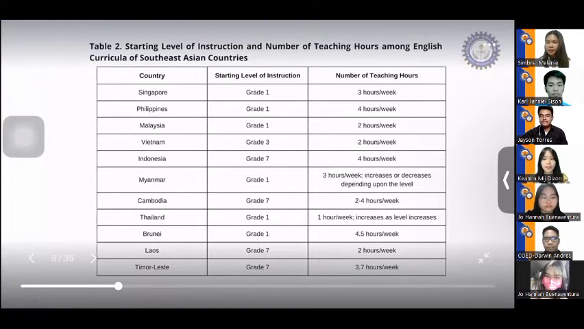
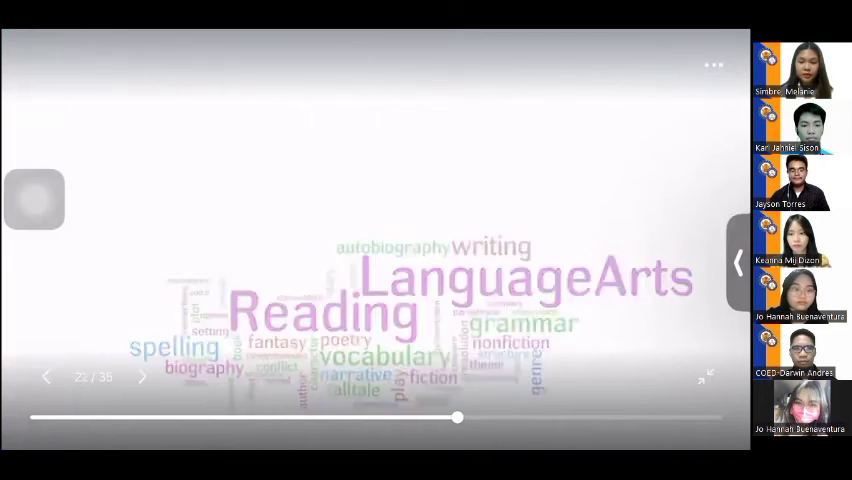
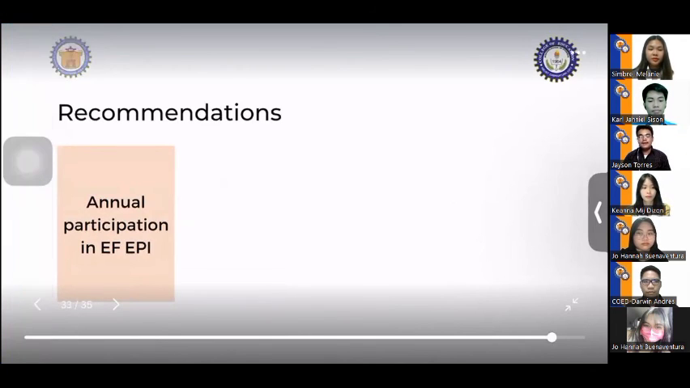
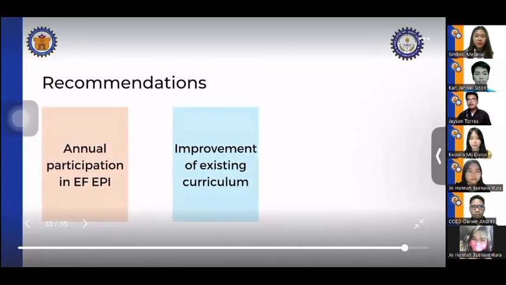

# International Conference Presentation: English Language Proficiency

- **Meeting ID / Name:** `sample_meeting`
- **Total Duration:** 10:06
- **Captured Slides / Sections:** 45
- **Dialogue Cues Processed:** 238

---

## Slide 01 [00:00 - 00:34] (Duration: 34.0s)

### Spoken Discussion:
- `[00:01]` **Speaker**: good day everyone it is our pleasure to
- `[00:04]` **Speaker**: be part of this year's International
- `[00:05]` **Speaker**: Conference in Innovation and educational
- `[00:08]` **Speaker**: hosted by its prestigious open
- `[00:10]` **Speaker**: University in Thailand and it is indeed
- `[00:13]` **Speaker**: an honor for us to present in This
- `[00:15]` **Speaker**: Global platform our research is
- `[00:18]` **Speaker**: English language Proficiency curricula
- `[00:21]` **Speaker**: in Southeast Asian countries
- `[00:23]` **Speaker**: being proficient in the English language
- `[00:25]` **Speaker**: brings a number of global advantages and
- `[00:28]` **Speaker**: so English language proficiency has
- `[00:30]` **Speaker**: become one of our most primary concerns
- `[00:33]` **Speaker**: aligned with this an organization known

---

## Slide 02 [00:34 - 01:27] (Duration: 53.0s)

### Spoken Discussion:
- `[00:36]` **Speaker**: as Education First or EF yearly measures
- `[00:39]` **Speaker**: the English language proficiency of
- `[00:41]` **Speaker**: different countries the globally
- `[00:43]` **Speaker**: published result is known as the EF
- `[00:45]` **Speaker**: English proficiency index or efepi in
- `[00:48]` **Speaker**: which almost all of the countries in
- `[00:50]` **Speaker**: Southeast Asia annually participate
- `[00:53]` **Speaker**: considering the annual results of efepi
- `[00:56]` **Speaker**: we have observed that they are Southeast
- `[00:58]` **Speaker**: Asian countries which are able to
- `[01:00]` **Speaker**: maintain their high or very high
- `[01:02]` **Speaker**: Proficiency in the language however it
- `[01:05]` **Speaker**: is also notable that there are countries
- `[01:07]` **Speaker**: in Southeast Asia which have been in the
- `[01:10]` **Speaker**: low or very low proficiency bands over
- `[01:12]` **Speaker**: the course of years
- `[01:15]` **Speaker**: hence with the researchers decided to
- `[01:18]` **Speaker**: conduct the study examining the English
- `[01:20]` **Speaker**: language proficiency curriculum among
- `[01:22]` **Speaker**: the Southeast Asian countries
- `[01:23]` **Speaker**: specifically we sought to answer the
- `[01:26]` **Speaker**: following questions

---

## Slide 03 [01:27 - 01:32] (Duration: 5.0s)

### Spoken Discussion:
- `[01:30]` **Speaker**: one tell me the English language

---

## Slide 04 [01:32 - 01:57] (Duration: 25.0s)

### Spoken Discussion:
- `[01:32]` **Speaker**: proficiency level of Southeast Asian
- `[01:34]` **Speaker**: countries be described based on the EF
- `[01:36]` **Speaker**: English proficiency index 2021 So What
- `[01:40]` **Speaker**: observations can be seen in the English
- `[01:43]` **Speaker**: education curriculum among the Southeast
- `[01:45]` **Speaker**: Asian countries three what are the other
- `[01:48]` **Speaker**: significant features of curricula in
- `[01:50]` **Speaker**: Southeast Asian countries which
- `[01:52]` **Speaker**: contribute in producing citizens with
- `[01:54]` **Speaker**: high English proficiency level

---

## Slide 05 [01:57 - 02:02] (Duration: 5.0s)

### Spoken Discussion:
- `[01:57]` **Speaker**: in this study we mainly based our data
- `[02:01]` **Speaker**: and conclusions and the results of EF

---

## Slide 06 [02:02 - 02:32] (Duration: 30.0s)

### Spoken Discussion:
- `[02:03]` **Speaker**: Epi 2021 Accord on the on the theory of
- `[02:07]` **Speaker**: Bradley about Effectiveness model for
- `[02:10]` **Speaker**: curriculum development indicators we
- `[02:12]` **Speaker**: examine the curricular Implement that
- `[02:14]` **Speaker**: implemented at this five years back
- `[02:15]` **Speaker**: since the data of EF Epi 2021 were
- `[02:19]` **Speaker**: likely the result of an English
- `[02:21]` **Speaker**: curriculum implemented by a certain
- `[02:23]` **Speaker**: country at least five years ago to
- `[02:26]` **Speaker**: gather the data from this study the
- `[02:28]` **Speaker**: researchers used the data mining
- `[02:30]` **Speaker**: approach

---

## Slide 07 [02:32 - 02:37] (Duration: 5.0s)

### Spoken Discussion:
- `[02:32]` **Speaker**: for the results of the study you can now
- `[02:35]` **Speaker**: see on your screen a table which shows

---

## Slide 08 [02:37 - 03:06] (Duration: 29.0s)

### Spoken Discussion:
- `[02:37]` **Speaker**: the result of aftpi of Southeast Asian
- `[02:40]` **Speaker**: countries in 2021. Singapore possessed a
- `[02:44]` **Speaker**: very high level of English proficiency
- `[02:46]` **Speaker**: Philippines and Malaysia with high level
- `[02:48]` **Speaker**: of proficiency Vietnam and Indonesia
- `[02:51]` **Speaker**: with low proficiency while Myanmar
- `[02:53]` **Speaker**: Cambodia and Thailand with very low
- `[02:56]` **Speaker**: proficiency Brunei Laos and Timor Lester
- `[02:59]` **Speaker**: were not included in the table because
- `[03:01]` **Speaker**: they were not able to participate in
- `[03:03]` **Speaker**: eseti 2024.

---

## Slide 09 [03:06 - 03:11] (Duration: 5.0s)

### Spoken Discussion:
- `[03:06]` **Speaker**: the next table shows the list of 11
- `[03:09]` **Speaker**: Southeast Asian countries as well as the

---

## Slide 10 [03:11 - 03:20] (Duration: 9.0s)

### Spoken Discussion:
- `[03:12]` **Speaker**: starting level of instruction and number
- `[03:14]` **Speaker**: of teaching hours implemented by their
- `[03:17]` **Speaker**: respective English curricula
- `[03:19]` **Speaker**: six countries started their English

---

## Slide 11 [03:20 - 03:25] (Duration: 5.0s)

### Spoken Discussion:
- `[03:21]` **Speaker**: instruction at grade one and they were
- `[03:24]` **Speaker**: Singapore the Philippines Malaysia

---

## Slide 12 [03:25 - 04:28] (Duration: 63.0s)

### Spoken Discussion:
- `[03:27]` **Speaker**: Myanmar Thailand and Brunei four
- `[03:30]` **Speaker**: countries started their English
- `[03:32]` **Speaker**: instruction at grade seven and they were
- `[03:34]` **Speaker**: Indonesia Cambodia Laos and timor-leste
- `[03:39]` **Speaker**: meanwhile Vietnam was the only one
- `[03:42]` **Speaker**: country which started its English
- `[03:44]` **Speaker**: education at grade 3.
- `[03:47]` **Speaker**: the table also shows that the number of
- `[03:49]` **Speaker**: teaching hours among Southeast Asian
- `[03:51]` **Speaker**: countries varied but it is notable that
- `[03:53]` **Speaker**: relatively those countries which started
- `[03:56]` **Speaker**: their English education at an earlier
- `[03:58]` **Speaker**: level and taught the language within a
- `[04:01]` **Speaker**: higher number of teaching hours are
- `[04:03]` **Speaker**: those countries that also achieved
- `[04:05]` **Speaker**: higher level of English proficiency
- `[04:08]` **Speaker**: nevertheless it can be noticed that
- `[04:10]` **Speaker**: despite teaching English at an earlier
- `[04:13]` **Speaker**: level Thailand and Myanmar were still in
- `[04:16]` **Speaker**: the lower proficiency band in this case
- `[04:19]` **Speaker**: we have to consider other factors which
- `[04:21]` **Speaker**: might have influenced the data such as
- `[04:24]` **Speaker**: the country's Colonial history and
- `[04:26]` **Speaker**: teachers expertise

---

## Slide 13 [04:28 - 04:33] (Duration: 5.0s)

### Spoken Discussion:
- `[04:28]` **Speaker**: foreign

---

## Slide 14 [04:33 - 04:54] (Duration: 21.0s)

### Spoken Discussion:
- `[04:33]` **Speaker**: was not colonized by English-speaking
- `[04:36]` **Speaker**: countries unlike the Philippines and
- `[04:38]` **Speaker**: Singapore in Myanmar Burmese is the main
- `[04:41]` **Speaker**: language and with this studies revealed
- `[04:43]` **Speaker**: that additional difficulties are
- `[04:45]` **Speaker**: associated with the acquisition of the
- `[04:47]` **Speaker**: English language
- `[04:49]` **Speaker**: moreover Myanmar did not offer
- `[04:52]` **Speaker**: specialized courses as part of their

---

## Slide 15 [04:54 - 04:59] (Duration: 5.0s)

### Spoken Discussion:
- `[04:54]` **Speaker**: press service teacher education this
- `[04:57]` **Speaker**: means that student teachers could not

---

## Slide 16 [04:59 - 05:39] (Duration: 40.0s)

### Spoken Discussion:
- `[04:59]` **Speaker**: focus on attained expertise in a
- `[05:02]` **Speaker**: particular subject such as English in
- `[05:05]` **Speaker**: Thailand there were also a limited
- `[05:07]` **Speaker**: number of English teachers so some
- `[05:09]` **Speaker**: teachers were forced to teach Concepts
- `[05:12]` **Speaker**: beyond their expertise for instance
- `[05:14]` **Speaker**: reports shows that some English teachers
- `[05:16]` **Speaker**: were 11 years old and Below were forced
- `[05:19]` **Speaker**: to teach students age 15 to 17 but in
- `[05:22]` **Speaker**: 2016 kailan collaborated with the
- `[05:25]` **Speaker**: British Council and launched a training
- `[05:27]` **Speaker**: program which including improves the
- `[05:29]` **Speaker**: expertise and strategies of English
- `[05:31]` **Speaker**: speakers in Thailand by training
- `[05:33]` **Speaker**: selected teachers who consequently will
- `[05:36]` **Speaker**: train the other teachers

---

## Slide 17 [05:39 - 05:44] (Duration: 5.0s)

### Spoken Discussion:
- `[05:41]` **Speaker**: in terms of teaching approach Singapore

---

## Slide 18 [05:44 - 05:49] (Duration: 5.0s)

### Spoken Discussion:
- `[05:44]` **Speaker**: Thailand and Brunei implemented the
- `[05:46]` **Speaker**: bilingual education system the Republic

---

## Slide 19 [05:49 - 05:59] (Duration: 10.0s)

### Spoken Discussion:
- `[05:49]` **Speaker**: of the Philippines adopted the K-12
- `[05:51]` **Speaker**: curriculum together with the mother
- `[05:53]` **Speaker**: tongue-based multilingual education
- `[05:55]` **Speaker**: under the language and art
- `[05:56]` **Speaker**: multi-literacies
- `[05:58]` **Speaker**: meanwhile Malaysia Indonesia Cambodia

---

## Slide 20 [05:59 - 06:04] (Duration: 5.0s)

### Spoken Discussion:
- `[06:01]` **Speaker**: laws applied the communicative language

---

## Slide 21 [06:04 - 06:20] (Duration: 16.0s)

### Spoken Discussion:
- `[06:04]` **Speaker**: teaching approach moreover Indonesia
- `[06:07]` **Speaker**: also applied learner-centered and
- `[06:09]` **Speaker**: experience-based instruction lost used
- `[06:12]` **Speaker**: the ordering one methods and demolition
- `[06:15]` **Speaker**: suggests that the use of students native
- `[06:18]` **Speaker**: language as medium of instruction

---

## Slide 22 [06:20 - 06:25] (Duration: 5.0s)

### Spoken Discussion:
- `[06:20]` **Speaker**: on the other hand Vietnam limited the
- `[06:23]` **Speaker**: words that must be learned in each grade
- `[06:24]` **Speaker**: its educational system focused on

---

## Slide 23 [06:25 - 06:40] (Duration: 15.0s)

### Spoken Discussion:
- `[06:27]` **Speaker**: accuracy rather than fluency lastly the
- `[06:30]` **Speaker**: English curriculum of Myanmar was based
- `[06:32]` **Speaker**: on the common European framework of
- `[06:34]` **Speaker**: reference for languages to ensure that
- `[06:36]` **Speaker**: the English language was taught in
- `[06:38]` **Speaker**: context

---

## Slide 24 [06:40 - 06:45] (Duration: 5.0s)

### Spoken Discussion:
- `[06:40]` **Speaker**: considering the data guarded the
- `[06:43]` **Speaker**: following significant features of

---

## Slide 25 [06:45 - 07:17] (Duration: 32.0s)

### Spoken Discussion:
- `[06:45]` **Speaker**: English were pointed out first the
- `[06:48]` **Speaker**: bilingual education system
- `[06:50]` **Speaker**: the data of 2010 Singapore census of
- `[06:53]` **Speaker**: population show that the percentage of
- `[06:56]` **Speaker**: residents who speak both English and
- `[06:59]` **Speaker**: other language and Singapore has
- `[07:01]` **Speaker**: increased by 13.5 percent compared to
- `[07:04]` **Speaker**: the previous data gathered in 2000 and
- `[07:07]` **Speaker**: 2010. apparently language magazine
- `[07:10]` **Speaker**: reported that it even increased to 48.3
- `[07:14]` **Speaker**: percent in 2020.

---

## Slide 26 [07:17 - 07:22] (Duration: 5.0s)

### Spoken Discussion:
- `[07:17]` **Speaker**: second the language and arts
- `[07:20]` **Speaker**: multiliteracy's curriculum in the

---

## Slide 27 [07:22 - 07:38] (Duration: 16.0s)

### Spoken Discussion:
- `[07:22]` **Speaker**: Philippines its Effectiveness is aligned
- `[07:24]` **Speaker**: with the Timeless concept such as John
- `[07:26]` **Speaker**: PJ's development learning theory since
- `[07:29]` **Speaker**: the curriculum applies the spiral
- `[07:31]` **Speaker**: progression way of learning the
- `[07:33]` **Speaker**: children's cognitive skills in language
- `[07:35]` **Speaker**: are being well developed

---

## Slide 28 [07:38 - 07:43] (Duration: 5.0s)

### Spoken Discussion:
- `[07:39]` **Speaker**: third City see how the activities in
- `[07:42]` **Speaker**: Malaysia will also proven to bring

---

## Slide 29 [07:43 - 07:53] (Duration: 10.0s)

### Spoken Discussion:
- `[07:43]` **Speaker**: significant Improvement to students
- `[07:45]` **Speaker**: English speaking skills including
- `[07:47]` **Speaker**: grammar skills vocabulary skills
- `[07:49]` **Speaker**: pragmatic competence and fluency

---

## Slide 30 [07:53 - 07:58] (Duration: 5.0s)

### Spoken Discussion:
- `[07:55]` **Speaker**: meanwhile some significant features from

---

## Slide 31 [07:58 - 08:03] (Duration: 5.0s)

### Spoken Discussion:
- `[07:58]` **Speaker**: the other Southeast Asian countries
- `[08:00]` **Speaker**: include earlier English instruction

---

## Slide 32 [08:03 - 08:08] (Duration: 5.0s)

### Spoken Discussion:
- `[08:04]` **Speaker**: learner-centered and experience based
- `[08:07]` **Speaker**: instruction

---

## Slide 33 [08:08 - 08:13] (Duration: 5.0s)

### Spoken Discussion:
- `[08:09]` **Speaker**: contextual teaching

---

## Slide 34 [08:13 - 08:18] (Duration: 5.0s)

### Spoken Discussion:
- `[08:13]` **Speaker**: and provision of continuous training for
- `[08:16]` **Speaker**: English teachers

---

## Slide 35 [08:18 - 08:23] (Duration: 5.0s)

### Spoken Discussion:
- `[08:19]` **Speaker**: therefore in light of the findings of
- `[08:22]` **Speaker**: the study the following conclusions were

---

## Slide 36 [08:23 - 09:04] (Duration: 41.0s)

### Spoken Discussion:
- `[08:25]` **Speaker**: drawn
- `[08:26]` **Speaker**: in spite of differences South East Asian
- `[08:29]` **Speaker**: countries have one thing in common they
- `[08:32]` **Speaker**: continuously revise their English
- `[08:33]` **Speaker**: curricula for further development
- `[08:36]` **Speaker**: or Improvement the higher the number of
- `[08:39]` **Speaker**: teaching hours is the higher the
- `[08:41]` **Speaker**: possibility for students to achieve
- `[08:43]` **Speaker**: higher proficiency
- `[08:45]` **Speaker**: relatively countries in which English
- `[08:48]` **Speaker**: instruction starts at an earlier level
- `[08:50]` **Speaker**: also tend to yield students with higher
- `[08:53]` **Speaker**: proficiency
- `[08:55]` **Speaker**: however other significant factors such
- `[08:58]` **Speaker**: as countries Colonial history and
- `[09:00]` **Speaker**: teachers expertise May interfere
- `[09:03]` **Speaker**: third the countries standing in efepi

---

## Slide 37 [09:04 - 09:09] (Duration: 5.0s)

### Spoken Discussion:
- `[09:07]` **Speaker**: 2021 can serve as a basis to help

---

## Slide 38 [09:09 - 09:20] (Duration: 11.0s)

### Spoken Discussion:
- `[09:10]` **Speaker**: identify these significant features of
- `[09:13]` **Speaker**: each curriculum which could be adopted
- `[09:15]` **Speaker**: by other countries to Foster their
- `[09:18]` **Speaker**: English education

---

## Slide 39 [09:20 - 09:25] (Duration: 5.0s)

### Spoken Discussion:
- `[09:21]` **Speaker**: the researchers have also constructed
- `[09:23]` **Speaker**: the following recommendations

---

## Slide 40 [09:25 - 09:35] (Duration: 10.0s)

### Spoken Discussion:
- `[09:25]` **Speaker**: firstly
- `[09:27]` **Speaker**: Southeast Asian countries May
- `[09:29]` **Speaker**: participate really in on EF Epi for
- `[09:32]` **Speaker**: continuous monitoring of improvement
- `[09:34]` **Speaker**: next countries with lower proficiency

---

## Slide 41 [09:35 - 09:40] (Duration: 5.0s)

### Spoken Discussion:
- `[09:37]` **Speaker**: May recognize pictures of their existing

---

## Slide 42 [09:40 - 09:45] (Duration: 5.0s)

### Spoken Discussion:
- `[09:40]` **Speaker**: curricula that can be improved
- `[09:42]` **Speaker**: finally countries with lower proficiency

---

## Slide 43 [09:45 - 09:54] (Duration: 9.0s)

### Spoken Discussion:
- `[09:45]` **Speaker**: may consider adopting the significant
- `[09:47]` **Speaker**: features of English curricula in
- `[09:50]` **Speaker**: Southeast Asian countries which
- `[09:51]` **Speaker**: performed well
- `[09:53]` **Speaker**: and that concludes our presentation we

---

## Slide 44 [09:54 - 09:59] (Duration: 5.0s)

### Spoken Discussion:
- `[09:56]` **Speaker**: believe that our research will hold a
- `[09:58]` **Speaker**: huge contribution in fostering English

---

## Slide 45 [09:59 - 10:06] (Duration: 7.5s)

### Spoken Discussion:
- `[10:00]` **Speaker**: language education throughout the world
- `[10:03]` **Speaker**: once again thank you very much

---
